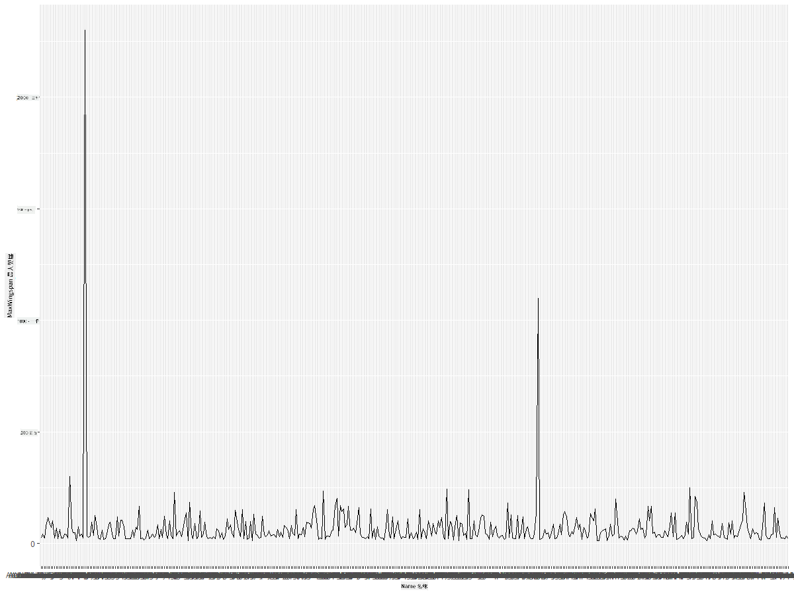
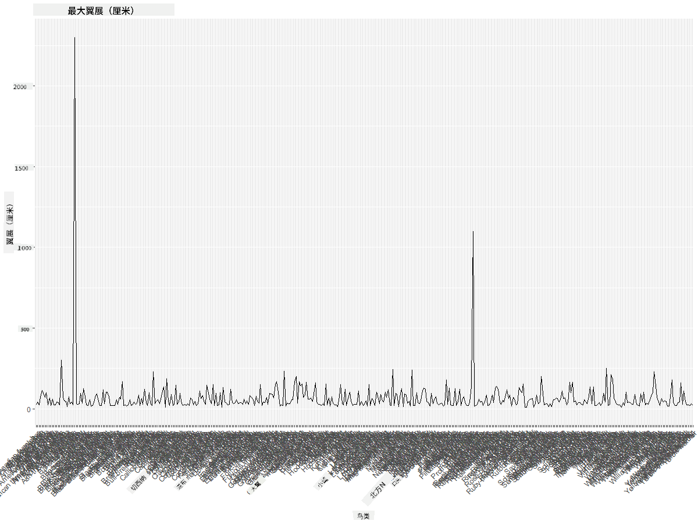
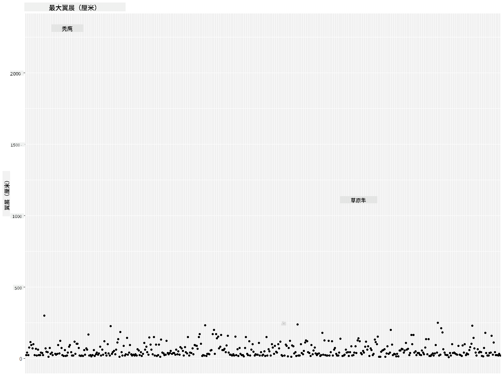
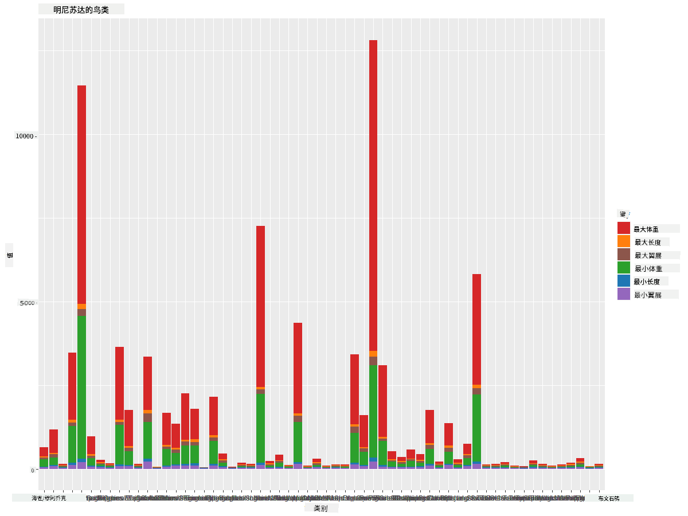
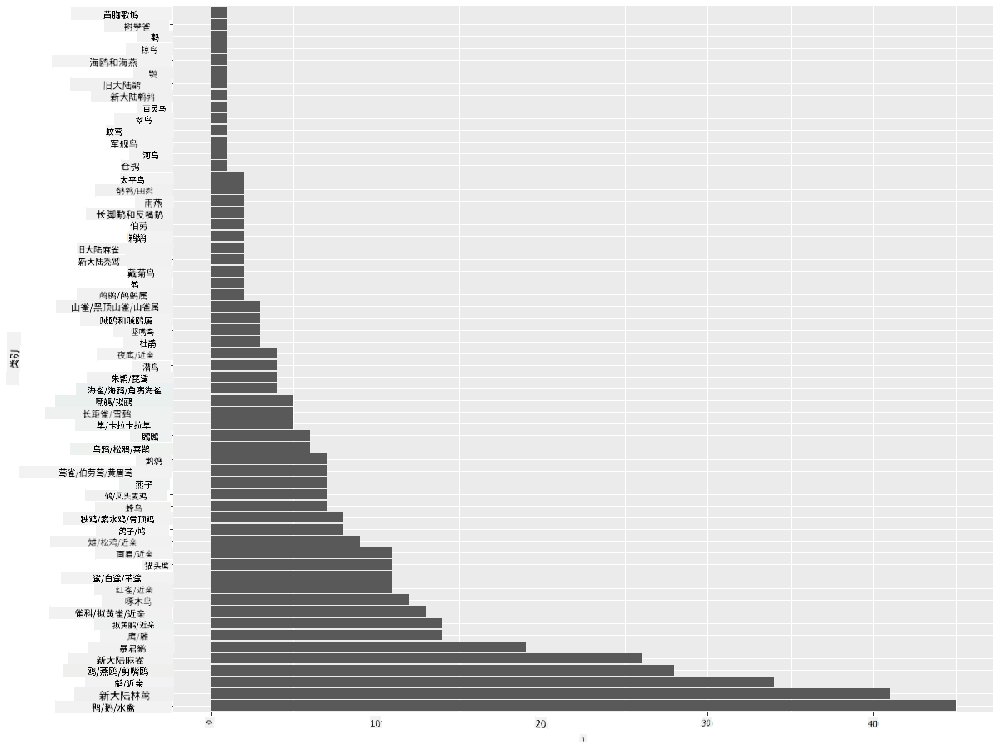
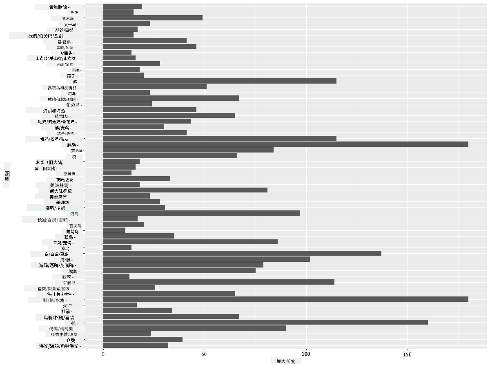
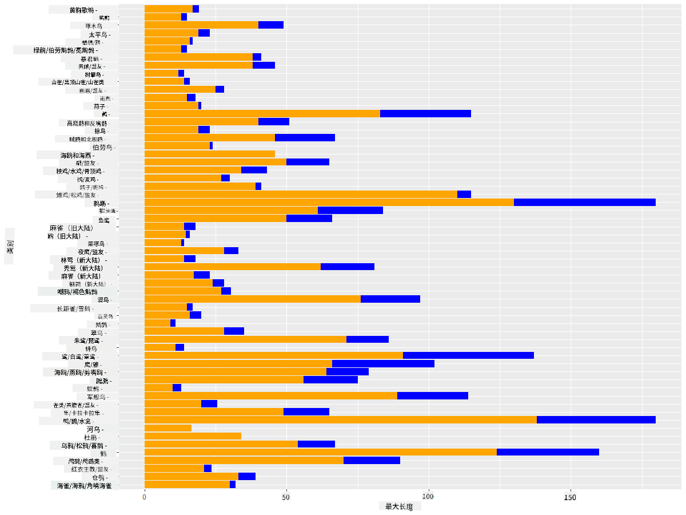

<!--
CO_OP_TRANSLATOR_METADATA:
{
  "original_hash": "22acf28f518a4769ea14fa42f4734b9f",
  "translation_date": "2025-08-25T18:20:34+00:00",
  "source_file": "3-Data-Visualization/R/09-visualization-quantities/README.md",
  "language_code": "zh"
}
-->
# 可视化数量
| 绘制的草图笔记](https://github.com/microsoft/Data-Science-For-Beginners/blob/main/sketchnotes/09-Visualizing-Quantities.png)|
|:---:|
| 可视化数量 - _草图笔记由 [@nitya](https://twitter.com/nitya) 绘制_ |

在本课中，你将学习如何使用一些 R 中可用的包库，围绕数量这一概念创建有趣的可视化。通过一个关于明尼苏达州鸟类的清理数据集，你可以了解许多关于当地野生动物的有趣事实。

## [课前测验](https://purple-hill-04aebfb03.1.azurestaticapps.net/quiz/16)

## 使用 ggplot2 观察翼展
[ggplot2](https://cran.r-project.org/web/packages/ggplot2/index.html) 是一个非常优秀的库，可以用来创建各种简单或复杂的图表。一般来说，使用这些库绘制数据图的过程包括：确定数据框中要处理的部分，对数据进行必要的转换，指定 x 和 y 轴的值，选择图表类型，然后展示图表。

`ggplot2` 是一个基于《图形语法》（The Grammar of Graphics）声明式创建图形的系统。《图形语法》是一种数据可视化的通用方案，将图形分解为语义组件，如比例和层次。换句话说，`ggplot2` 通过少量代码即可轻松创建单变量或多变量数据的图表，这使其成为 R 中最受欢迎的可视化包。用户只需告诉 `ggplot2` 如何将变量映射到美学属性、使用哪些图形元素，剩下的由 `ggplot2` 处理。

> ✅ 图表 = 数据 + 美学 + 几何
> - 数据：指数据集
> - 美学：表示要研究的变量（x 和 y 变量）
> - 几何：指图表类型（折线图、柱状图等）

根据你的数据和想通过图表讲述的故事，选择最合适的几何类型（图表类型）。

> - 分析趋势：折线图、柱状图
> - 比较数值：条形图、柱状图、饼图、散点图
> - 展示部分与整体的关系：饼图
> - 展示数据分布：散点图、条形图
> - 展示数值之间的关系：折线图、散点图、气泡图

✅ 你还可以查看这个描述性的 [ggplot2 速查表](https://nyu-cdsc.github.io/learningr/assets/data-visualization-2.1.pdf)。

## 绘制鸟类翼展值的折线图

打开 R 控制台并导入数据集。
> 注意：数据集存储在本仓库的 `/data` 文件夹中。

让我们导入数据集并观察数据的头部（前 5 行）。

```r
birds <- read.csv("../../data/birds.csv",fileEncoding="UTF-8-BOM")
head(birds)
```
数据头部包含文本和数字的混合：

|      | 名称                          | 学名                   | 类别                  | 目           | 科       | 属          | 保护状态         | 最小长度 | 最大长度 | 最小体重   | 最大体重   | 最小翼展   | 最大翼展   |
| ---: | :--------------------------- | :--------------------- | :-------------------- | :----------- | :------- | :---------- | :---------------- | --------: | --------: | ----------: | ----------: | ----------: | ----------: |
|    0 | 黑腹树鸭                     | Dendrocygna autumnalis | 鸭/鹅/水禽            | 雁形目       | 鸭科     | 树鸭属       | LC                 |        47 |        56 |         652 |        1020 |          76 |          94 |
|    1 | 棕树鸭                       | Dendrocygna bicolor    | 鸭/鹅/水禽            | 雁形目       | 鸭科     | 树鸭属       | LC                 |        45 |        53 |         712 |        1050 |          85 |          93 |
|    2 | 雪鹅                         | Anser caerulescens     | 鸭/鹅/水禽            | 雁形目       | 鸭科     | 鹅属         | LC                 |        64 |        79 |        2050 |        4050 |         135 |         165 |
|    3 | 罗斯氏鹅                     | Anser rossii           | 鸭/鹅/水禽            | 雁形目       | 鸭科     | 鹅属         | LC                 |      57.3 |        64 |        1066 |        1567 |         113 |         116 |
|    4 | 大白额雁                     | Anser albifrons        | 鸭/鹅/水禽            | 雁形目       | 鸭科     | 鹅属         | LC                 |        64 |        81 |        1930 |        3310 |         130 |         165 |

让我们从绘制一些数值数据的基本折线图开始。假设你想查看这些有趣鸟类的最大翼展。

```r
install.packages("ggplot2")
library("ggplot2")
ggplot(data=birds, aes(x=Name, y=MaxWingspan,group=1)) +
  geom_line() 
```
在这里，你安装了 `ggplot2` 包并通过 `library("ggplot2")` 命令将其导入工作区。要在 ggplot 中绘制任何图表，使用 `ggplot()` 函数，并将数据集、x 和 y 变量作为属性指定。在这种情况下，我们使用 `geom_line()` 函数，因为我们要绘制折线图。



你立即注意到了什么？似乎至少有一个异常值——那是一个相当惊人的翼展！2000+ 厘米的翼展超过了 20 米——难道明尼苏达州有翼龙在飞翔？让我们调查一下。

虽然你可以在 Excel 中快速排序找到这些可能是输入错误的异常值，但我们继续通过图表进行可视化分析。

为 x 轴添加标签以显示涉及哪些鸟类：

```r
ggplot(data=birds, aes(x=Name, y=MaxWingspan,group=1)) +
  geom_line() +
  theme(axis.text.x = element_text(angle = 45, hjust=1))+
  xlab("Birds") +
  ylab("Wingspan (CM)") +
  ggtitle("Max Wingspan in Centimeters")
```
我们在 `theme` 中指定了角度，并在 `xlab()` 和 `ylab()` 中分别指定了 x 和 y 轴的标签。`ggtitle()` 为图表命名。



即使将标签旋转到 45 度，仍然太多了，难以阅读。让我们尝试另一种策略：仅标记那些异常值，并在图表内设置标签。你可以使用散点图来腾出更多空间进行标记：

```r
ggplot(data=birds, aes(x=Name, y=MaxWingspan,group=1)) +
  geom_point() +
  geom_text(aes(label=ifelse(MaxWingspan>500,as.character(Name),'')),hjust=0,vjust=0) + 
  theme(axis.title.x=element_blank(), axis.text.x=element_blank(), axis.ticks.x=element_blank())
  ylab("Wingspan (CM)") +
  ggtitle("Max Wingspan in Centimeters") + 
```
这里发生了什么？你使用了 `geom_point()` 函数绘制散点图。通过这种方式，你为 `MaxWingspan > 500` 的鸟类添加了标签，同时隐藏了 x 轴上的标签以减少图表的杂乱。

你发现了什么？



## 筛选数据

无论是秃鹰还是草原隼，虽然可能是非常大的鸟类，但它们的最大翼展似乎被错误标记，多加了一个 0。遇到翼展 25 米的秃鹰的可能性不大，但如果真的遇到，请告诉我们！让我们创建一个新的数据框，去掉这两个异常值：

```r
birds_filtered <- subset(birds, MaxWingspan < 500)

ggplot(data=birds_filtered, aes(x=Name, y=MaxWingspan,group=1)) +
  geom_point() +
  ylab("Wingspan (CM)") +
  xlab("Birds") +
  ggtitle("Max Wingspan in Centimeters") + 
  geom_text(aes(label=ifelse(MaxWingspan>500,as.character(Name),'')),hjust=0,vjust=0) +
  theme(axis.text.x=element_blank(), axis.ticks.x=element_blank())
```
我们创建了一个新的数据框 `birds_filtered`，然后绘制了一个散点图。通过筛选掉异常值，你的数据现在更加连贯且易于理解。


现在我们至少在翼展方面有了一个更干净的数据集，让我们进一步探索这些鸟类。

虽然折线图和散点图可以显示数据值及其分布的信息，但我们还想思考数据集中固有的值。你可以创建可视化来回答以下关于数量的问题：

> 有多少种鸟类类别？它们的数量是多少？
> 有多少鸟类是灭绝的、濒危的、稀有的或常见的？
> 根据林奈分类法，有多少种不同的属和目？

## 探索条形图

当你需要展示数据分组时，条形图非常实用。让我们探索数据集中存在的鸟类类别，看看哪种类别最常见。
让我们在筛选后的数据上创建一个条形图。

```r
install.packages("dplyr")
install.packages("tidyverse")

library(lubridate)
library(scales)
library(dplyr)
library(ggplot2)
library(tidyverse)

birds_filtered %>% group_by(Category) %>%
  summarise(n=n(),
  MinLength = mean(MinLength),
  MaxLength = mean(MaxLength),
  MinBodyMass = mean(MinBodyMass),
  MaxBodyMass = mean(MaxBodyMass),
  MinWingspan=mean(MinWingspan),
  MaxWingspan=mean(MaxWingspan)) %>% 
  gather("key", "value", - c(Category, n)) %>%
  ggplot(aes(x = Category, y = value, group = key, fill = key)) +
  geom_bar(stat = "identity") +
  scale_fill_manual(values = c("#D62728", "#FF7F0E", "#8C564B","#2CA02C", "#1F77B4", "#9467BD")) +                   
  xlab("Category")+ggtitle("Birds of Minnesota")

```
在以下代码片段中，我们安装了 [dplyr](https://www.rdocumentation.org/packages/dplyr/versions/0.7.8) 和 [lubridate](https://www.rdocumentation.org/packages/lubridate/versions/1.8.0) 包，以帮助操作和分组数据，从而绘制堆叠条形图。首先，你按鸟类的 `Category` 分组数据，然后汇总 `MinLength`、`MaxLength`、`MinBodyMass`、`MaxBodyMass`、`MinWingspan`、`MaxWingspan` 列。接着，使用 `ggplot2` 包绘制条形图，并为不同类别指定颜色和标签。



然而，这个条形图由于数据未分组过多而难以阅读。你需要选择要绘制的数据，因此让我们根据鸟类类别查看其长度。

筛选数据以仅包含鸟类的类别。

由于类别较多，你可以垂直显示此图表并调整其高度以适应所有数据：

```r
birds_count<-dplyr::count(birds_filtered, Category, sort = TRUE)
birds_count$Category <- factor(birds_count$Category, levels = birds_count$Category)
ggplot(birds_count,aes(Category,n))+geom_bar(stat="identity")+coord_flip()
```
你首先统计 `Category` 列中的唯一值，然后将它们排序到一个新的数据框 `birds_count` 中。接着，将这些排序后的数据按相同顺序分级，以便按排序方式绘制。使用 `ggplot2` 绘制条形图。`coord_flip()` 将条形图水平显示。



这个条形图很好地展示了每个类别中鸟类的数量。一眼就能看出，这个地区数量最多的鸟类是鸭/鹅/水禽类别。明尼苏达州是“万湖之地”，这并不令人意外！

✅ 尝试对该数据集进行其他计数。有什么让你感到惊讶的吗？

## 比较数据

你可以通过创建新的轴来尝试不同的分组数据比较。尝试比较基于类别的鸟类最大长度：

```r
birds_grouped <- birds_filtered %>%
  group_by(Category) %>%
  summarise(
  MaxLength = max(MaxLength, na.rm = T),
  MinLength = max(MinLength, na.rm = T)
           ) %>%
  arrange(Category)
  
ggplot(birds_grouped,aes(Category,MaxLength))+geom_bar(stat="identity")+coord_flip()
```
我们按 `Category` 对 `birds_filtered` 数据进行分组，然后绘制条形图。



这里没有什么令人意外的：蜂鸟的最大长度最小，而鹈鹕或鹅的最大长度较大。当数据符合逻辑时，这是好事！

你可以通过叠加数据创建更有趣的条形图可视化。让我们在给定的鸟类类别上叠加最小和最大长度：

```r
ggplot(data=birds_grouped, aes(x=Category)) +
  geom_bar(aes(y=MaxLength), stat="identity", position ="identity",  fill='blue') +
  geom_bar(aes(y=MinLength), stat="identity", position="identity", fill='orange')+
  coord_flip()
```


## 🚀 挑战

这个鸟类数据集提供了关于特定生态系统中不同类型鸟类的大量信息。在互联网上搜索，看看是否能找到其他与鸟类相关的数据集。练习围绕这些鸟类构建图表和图形，发现你之前未曾意识到的事实。

## [课后测验](https://purple-hill-04aebfb03.1.azurestaticapps.net/quiz/17)

## 复习与自学

本课为你提供了一些关于如何使用 `ggplot2` 可视化数量的信息。研究其他可视化数据集的方法。查找并研究可以使用其他包（如 [Lattice](https://stat.ethz.ch/R-manual/R-devel/library/lattice/html/Lattice.html) 和 [Plotly](https://github.com/plotly/plotly.R#readme)）进行可视化的数据集。

## 作业
[折线图、散点图和条形图](assignment.md)

**免责声明**：  
本文档使用AI翻译服务 [Co-op Translator](https://github.com/Azure/co-op-translator) 进行翻译。尽管我们努力确保翻译的准确性，但请注意，自动翻译可能包含错误或不准确之处。应以原始语言的文档作为权威来源。对于重要信息，建议使用专业人工翻译。我们对因使用此翻译而产生的任何误解或误读不承担责任。