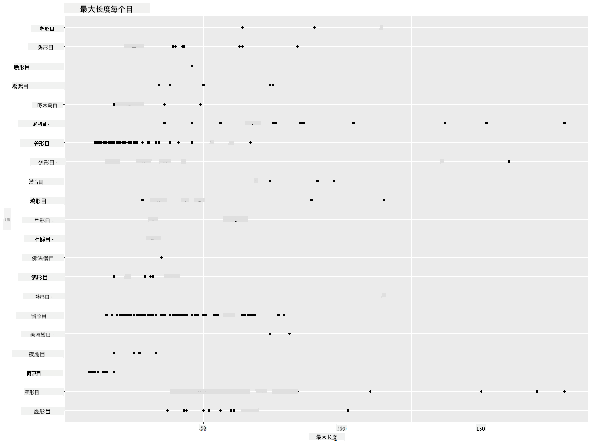
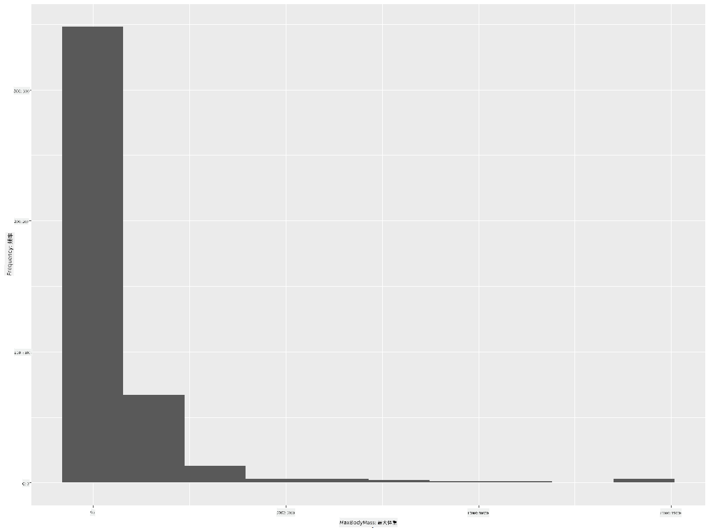
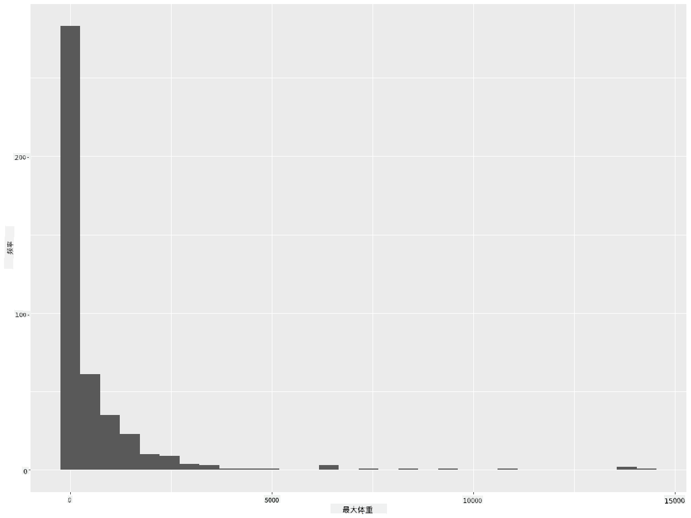
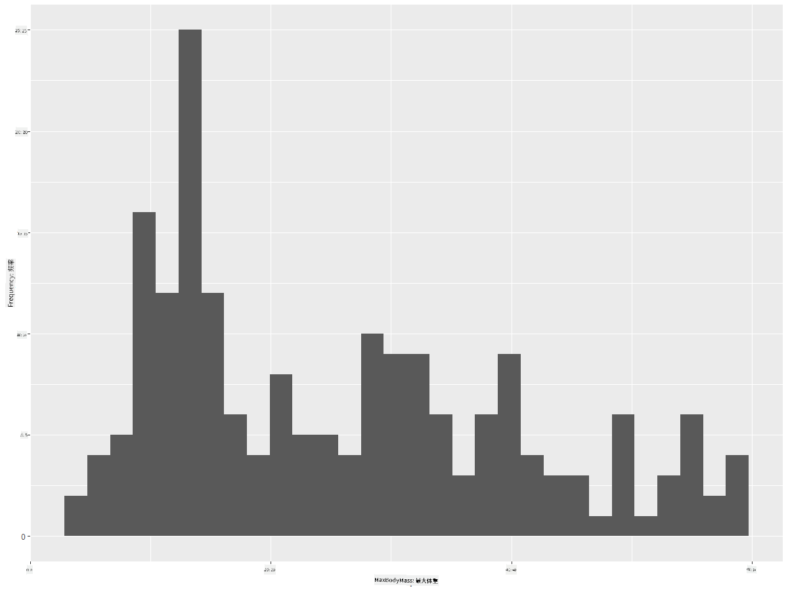
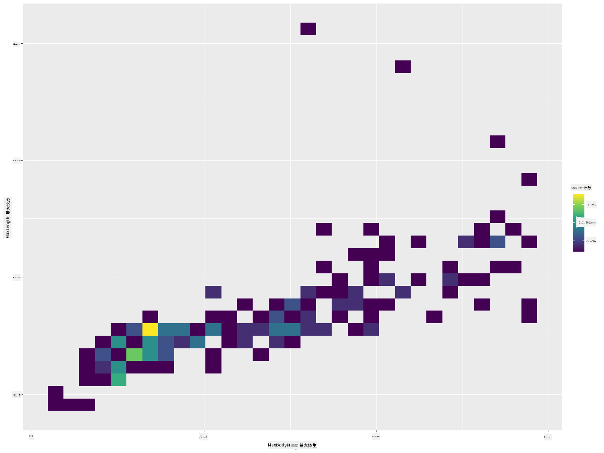
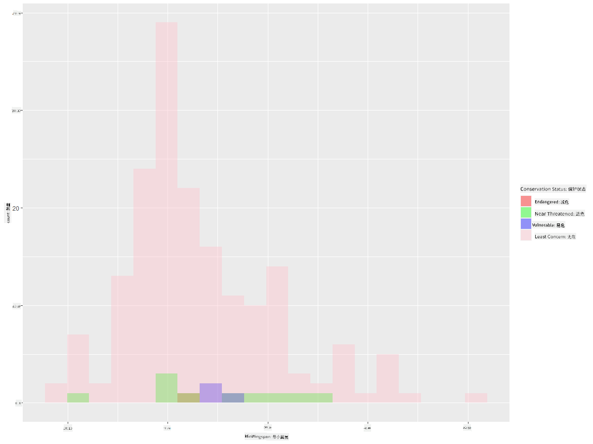
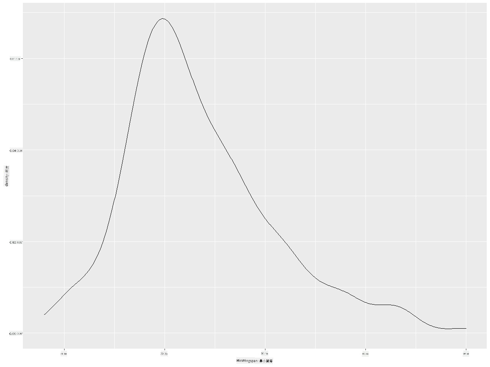
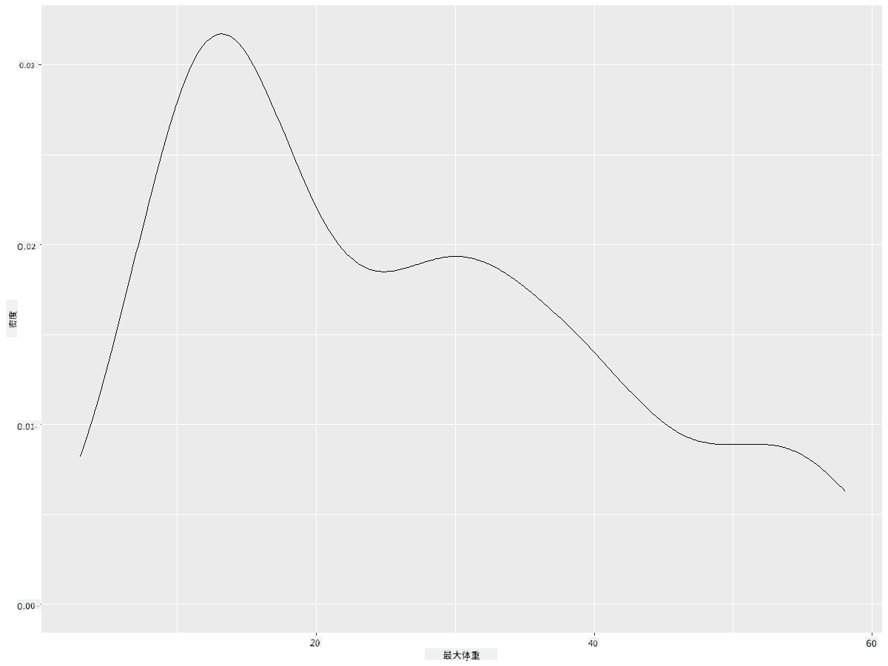
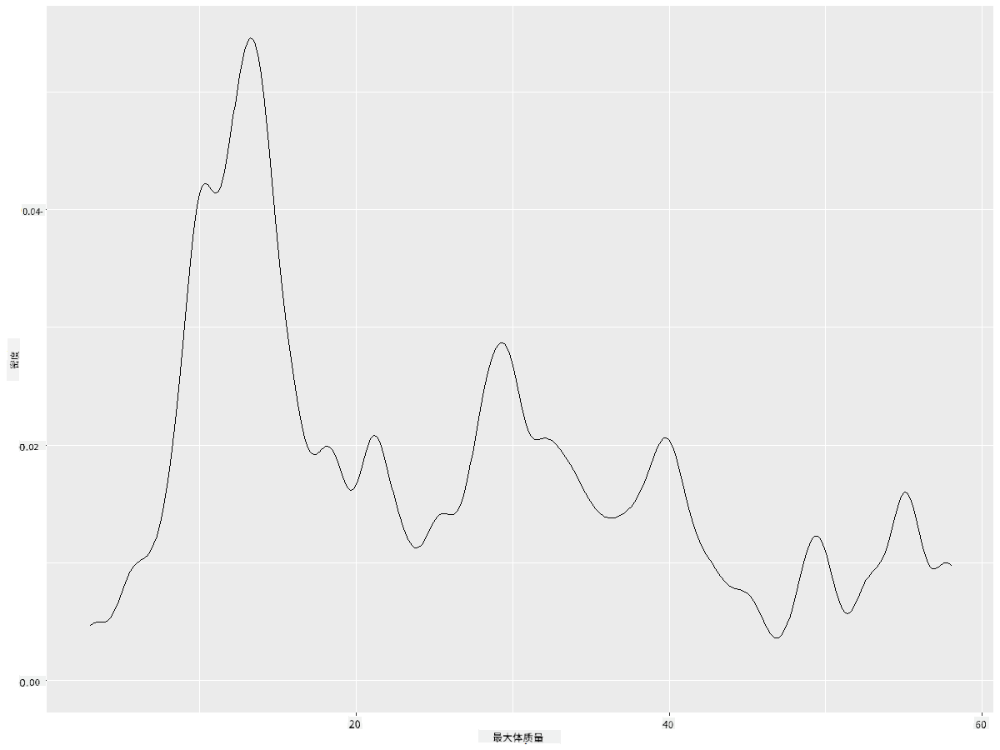
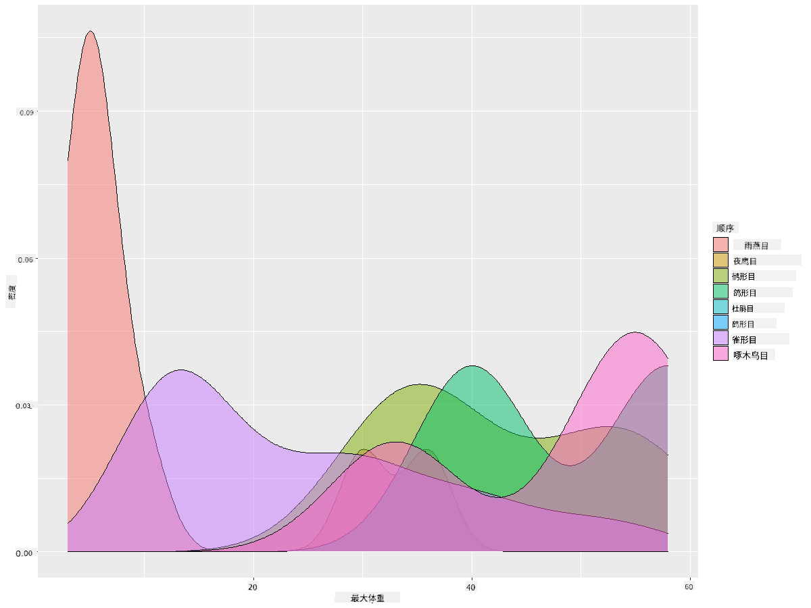

<!--
CO_OP_TRANSLATOR_METADATA:
{
  "original_hash": "ea67c0c40808fd723594de6896c37ccf",
  "translation_date": "2025-08-25T18:12:47+00:00",
  "source_file": "3-Data-Visualization/R/10-visualization-distributions/README.md",
  "language_code": "zh"
}
-->
# 可视化分布

| 绘制的速记图](https://github.com/microsoft/Data-Science-For-Beginners/blob/main/sketchnotes/10-Visualizing-Distributions.png)|
|:---:|
| 可视化分布 - _速记图作者 [@nitya](https://twitter.com/nitya)_ |

在上一节课中，你学习了关于明尼苏达州鸟类数据集的一些有趣事实。通过可视化异常值，你发现了一些错误数据，并通过最大长度观察了鸟类类别之间的差异。

## [课前测验](https://purple-hill-04aebfb03.1.azurestaticapps.net/quiz/18)
## 探索鸟类数据集

另一种深入了解数据的方法是查看其分布，即数据如何沿轴排列。例如，你可能想了解这个数据集中鸟类的最大翼展或最大体重的一般分布情况。

让我们来发现一些关于这个数据集分布的事实。在你的 R 控制台中，导入 `ggplot2` 和数据库。像上一节一样，从数据库中移除异常值。

```r
library(ggplot2)

birds <- read.csv("../../data/birds.csv",fileEncoding="UTF-8-BOM")

birds_filtered <- subset(birds, MaxWingspan < 500)
head(birds_filtered)
```
|      | 名称                         | 学名                   | 类别                  | 目           | 科       | 属          | 保护状态           | 最小长度 | 最大长度 | 最小体重     | 最大体重     | 最小翼展     | 最大翼展     |
| ---: | :--------------------------- | :--------------------- | :-------------------- | :----------- | :------- | :---------- | :----------------- | --------: | --------: | ----------: | ----------: | ----------: | ----------: |
|    0 | 黑腹叫鸭                     | Dendrocygna autumnalis | 鸭/鹅/水禽            | 雁形目       | 鸭科     | 栖鸭属      | LC                 |        47 |        56 |         652 |        1020 |          76 |          94 |
|    1 | 棕腹叫鸭                     | Dendrocygna bicolor    | 鸭/鹅/水禽            | 雁形目       | 鸭科     | 栖鸭属      | LC                 |        45 |        53 |         712 |        1050 |          85 |          93 |
|    2 | 雪鹅                         | Anser caerulescens     | 鸭/鹅/水禽            | 雁形目       | 鸭科     | 雁属        | LC                 |        64 |        79 |        2050 |        4050 |         135 |         165 |
|    3 | 罗氏鹅                       | Anser rossii           | 鸭/鹅/水禽            | 雁形目       | 鸭科     | 雁属        | LC                 |      57.3 |        64 |        1066 |        1567 |         113 |         116 |
|    4 | 大白额雁                     | Anser albifrons        | 鸭/鹅/水禽            | 雁形目       | 鸭科     | 雁属        | LC                 |        64 |        81 |        1930 |        3310 |         130 |         165 |

通常，你可以通过使用散点图快速查看数据的分布方式，就像我们在上一节课中所做的那样：

```r
ggplot(data=birds_filtered, aes(x=Order, y=MaxLength,group=1)) +
  geom_point() +
  ggtitle("Max Length per order") + coord_flip()
```


这提供了每个鸟类目身体长度的一般分布概览，但这并不是显示真实分布的最佳方式。通常通过创建直方图来完成这一任务。

## 使用直方图

`ggplot2` 提供了非常好的方法来使用直方图可视化数据分布。这种图表类似于柱状图，通过柱子的升降可以看到分布情况。要构建直方图，你需要数值数据。构建直方图时，可以将图表类型定义为“hist”以表示直方图。此图表显示整个数据集范围内最大体重的分布。通过将数据数组划分为较小的区间，它可以显示数据值的分布：

```r
ggplot(data = birds_filtered, aes(x = MaxBodyMass)) + 
  geom_histogram(bins=10)+ylab('Frequency')
```


如你所见，这个数据集中的 400 多种鸟类大多数最大体重都在 2000 以下。通过将 `bins` 参数更改为更高的数字，例如 30，可以获得更多数据洞察：

```r
ggplot(data = birds_filtered, aes(x = MaxBodyMass)) + geom_histogram(bins=30)+ylab('Frequency')
```



此图表以更细致的方式显示分布。通过确保仅选择特定范围内的数据，可以创建一个偏向左侧较少的图表：

过滤数据，仅获取体重低于 60 的鸟类，并显示 30 个 `bins`：

```r
birds_filtered_1 <- subset(birds_filtered, MaxBodyMass > 1 & MaxBodyMass < 60)
ggplot(data = birds_filtered_1, aes(x = MaxBodyMass)) + 
  geom_histogram(bins=30)+ylab('Frequency')
```



✅ 尝试其他过滤器和数据点。要查看数据的完整分布，请移除 `['MaxBodyMass']` 过滤器以显示带标签的分布。

直方图还提供了一些不错的颜色和标签增强功能可以尝试：

创建一个二维直方图来比较两个分布之间的关系。让我们比较 `MaxBodyMass` 和 `MaxLength`。`ggplot2` 提供了一种内置方法，通过更亮的颜色显示收敛：

```r
ggplot(data=birds_filtered_1, aes(x=MaxBodyMass, y=MaxLength) ) +
  geom_bin2d() +scale_fill_continuous(type = "viridis")
```
可以看到这两个元素沿预期轴存在预期的相关性，其中一个点的收敛特别强：



直方图默认适用于数值数据。如果需要根据文本数据查看分布该怎么办？

## 使用文本数据探索数据集分布

此数据集还包括关于鸟类类别及其属、种、科以及保护状态的良好信息。让我们深入了解这些保护信息。根据保护状态，鸟类的分布情况如何？

> ✅ 在数据集中，使用了一些缩写来描述保护状态。这些缩写来自 [IUCN 红色名录类别](https://www.iucnredlist.org/)，这是一个记录物种状态的组织。
> 
> - CR: 极危
> - EN: 濒危
> - EX: 灭绝
> - LC: 无危
> - NT: 近危
> - VU: 易危

这些是基于文本的值，因此需要进行转换以创建直方图。使用过滤后的鸟类数据框，显示其保护状态及其最小翼展。你看到了什么？

```r
birds_filtered_1$ConservationStatus[birds_filtered_1$ConservationStatus == 'EX'] <- 'x1' 
birds_filtered_1$ConservationStatus[birds_filtered_1$ConservationStatus == 'CR'] <- 'x2'
birds_filtered_1$ConservationStatus[birds_filtered_1$ConservationStatus == 'EN'] <- 'x3'
birds_filtered_1$ConservationStatus[birds_filtered_1$ConservationStatus == 'NT'] <- 'x4'
birds_filtered_1$ConservationStatus[birds_filtered_1$ConservationStatus == 'VU'] <- 'x5'
birds_filtered_1$ConservationStatus[birds_filtered_1$ConservationStatus == 'LC'] <- 'x6'

ggplot(data=birds_filtered_1, aes(x = MinWingspan, fill = ConservationStatus)) +
  geom_histogram(position = "identity", alpha = 0.4, bins = 20) +
  scale_fill_manual(name="Conservation Status",values=c("red","green","blue","pink"),labels=c("Endangered","Near Threathened","Vulnerable","Least Concern"))
```



最小翼展与保护状态之间似乎没有明显的相关性。使用此方法测试数据集中的其他元素。你可以尝试不同的过滤器。是否发现任何相关性？

## 密度图

你可能注意到我们迄今为止看到的直方图是“阶梯状”的，并没有平滑地呈弧形。要显示更平滑的密度图，可以尝试密度图。

现在让我们来使用密度图！

```r
ggplot(data = birds_filtered_1, aes(x = MinWingspan)) + 
  geom_density()
```


你可以看到此图与之前的最小翼展数据图相呼应；它只是稍微平滑了一些。如果你想重新创建第二个图表中那个不平滑的最大体重线，可以通过这种方法很好地将其平滑化：

```r
ggplot(data = birds_filtered_1, aes(x = MaxBodyMass)) + 
  geom_density()
```


如果你想要一个平滑但不过于平滑的线条，可以编辑 `adjust` 参数：

```r
ggplot(data = birds_filtered_1, aes(x = MaxBodyMass)) + 
  geom_density(adjust = 1/5)
```


✅ 阅读有关此类图表可用参数的内容并进行实验！

这种图表提供了非常直观的可视化。例如，通过几行代码，你可以显示每个鸟类目最大体重的密度：

```r
ggplot(data=birds_filtered_1,aes(x = MaxBodyMass, fill = Order)) +
  geom_density(alpha=0.5)
```


## 🚀 挑战

直方图是一种比基本散点图、柱状图或折线图更复杂的图表类型。上网搜索直方图的优秀使用案例。它们是如何使用的，展示了什么内容，以及它们通常在哪些领域或研究领域中使用？

## [课后测验](https://purple-hill-04aebfb03.1.azurestaticapps.net/quiz/19)

## 复习与自学

在本课中，你使用了 `ggplot2` 并开始展示更复杂的图表。研究一下 `geom_density_2d()`，它是一种“一维或多维的连续概率密度曲线”。阅读 [文档](https://ggplot2.tidyverse.org/reference/geom_density_2d.html) 以了解其工作原理。

## 作业

[应用你的技能](assignment.md)

**免责声明**：  
本文档使用AI翻译服务 [Co-op Translator](https://github.com/Azure/co-op-translator) 进行翻译。尽管我们努力确保翻译的准确性，但请注意，自动翻译可能包含错误或不准确之处。原始语言的文档应被视为权威来源。对于关键信息，建议使用专业人工翻译。我们不对因使用此翻译而产生的任何误解或误读承担责任。