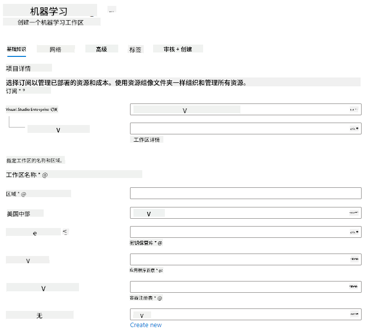

<!--
CO_OP_TRANSLATOR_METADATA:
{
  "original_hash": "14b2a7f1c63202920bd98eeb913f5614",
  "translation_date": "2025-08-25T17:20:12+00:00",
  "source_file": "5-Data-Science-In-Cloud/18-Low-Code/README.md",
  "language_code": "zh"
}
-->
# 云端数据科学：低代码/无代码方式

| ](../../sketchnotes/18-DataScience-Cloud.png)|
|:---:|
| 云端数据科学：低代码 - _Sketchnote by [@nitya](https://twitter.com/nitya)_ |

目录：

- [云端数据科学：低代码/无代码方式](../../../../5-Data-Science-In-Cloud/18-Low-Code)
  - [课前测验](../../../../5-Data-Science-In-Cloud/18-Low-Code)
  - [1. 介绍](../../../../5-Data-Science-In-Cloud/18-Low-Code)
    - [1.1 什么是 Azure Machine Learning？](../../../../5-Data-Science-In-Cloud/18-Low-Code)
    - [1.2 心力衰竭预测项目：](../../../../5-Data-Science-In-Cloud/18-Low-Code)
    - [1.3 心力衰竭数据集：](../../../../5-Data-Science-In-Cloud/18-Low-Code)
  - [2. 在 Azure ML Studio 中低代码/无代码训练模型](../../../../5-Data-Science-In-Cloud/18-Low-Code)
    - [2.1 创建 Azure ML 工作区](../../../../5-Data-Science-In-Cloud/18-Low-Code)
    - [2.2 计算资源](../../../../5-Data-Science-In-Cloud/18-Low-Code)
      - [2.2.1 为计算资源选择合适的选项](../../../../5-Data-Science-In-Cloud/18-Low-Code)
      - [2.2.2 创建计算集群](../../../../5-Data-Science-In-Cloud/18-Low-Code)
    - [2.3 加载数据集](../../../../5-Data-Science-In-Cloud/18-Low-Code)
    - [2.4 使用 AutoML 进行低代码/无代码训练](../../../../5-Data-Science-In-Cloud/18-Low-Code)
  - [3. 低代码/无代码模型部署与端点使用](../../../../5-Data-Science-In-Cloud/18-Low-Code)
    - [3.1 模型部署](../../../../5-Data-Science-In-Cloud/18-Low-Code)
    - [3.2 端点使用](../../../../5-Data-Science-In-Cloud/18-Low-Code)
  - [🚀 挑战](../../../../5-Data-Science-In-Cloud/18-Low-Code)
  - [课后测验](../../../../5-Data-Science-In-Cloud/18-Low-Code)
  - [复习与自学](../../../../5-Data-Science-In-Cloud/18-Low-Code)
  - [作业](../../../../5-Data-Science-In-Cloud/18-Low-Code)

## [课前测验](https://purple-hill-04aebfb03.1.azurestaticapps.net/quiz/34)

## 1. 介绍

### 1.1 什么是 Azure Machine Learning？

Azure 云平台包含超过 200 种产品和云服务，旨在帮助您实现创新解决方案。数据科学家通常需要花费大量时间探索和预处理数据，并尝试各种模型训练算法以生成准确的模型。这些任务耗时且可能导致昂贵的计算硬件使用效率低下。

[Azure ML](https://docs.microsoft.com/azure/machine-learning/overview-what-is-azure-machine-learning?WT.mc_id=academic-77958-bethanycheum&ocid=AID3041109) 是一个基于云的平台，用于在 Azure 中构建和运行机器学习解决方案。它提供了广泛的功能和能力，帮助数据科学家准备数据、训练模型、发布预测服务并监控其使用情况。最重要的是，它通过自动化许多与模型训练相关的耗时任务来提高效率；同时，它支持使用可扩展的云计算资源来处理大量数据，仅在实际使用时产生费用。

Azure ML 提供了开发者和数据科学家所需的所有工具，用于完成机器学习工作流程。这些工具包括：

- **Azure Machine Learning Studio**：一个基于 Web 的门户，提供低代码和无代码选项，用于模型训练、部署、自动化、跟踪和资产管理。Studio 与 Azure Machine Learning SDK 集成，提供无缝体验。
- **Jupyter Notebooks**：快速原型设计和测试机器学习模型。
- **Azure Machine Learning Designer**：通过拖放模块构建实验，并在低代码环境中部署管道。
- **自动化机器学习界面 (AutoML)**：自动化机器学习模型开发的迭代任务，能够以高效和高生产力的方式构建模型，同时保持模型质量。
- **数据标注**：一个辅助机器学习工具，用于自动标注数据。
- **Visual Studio Code 的机器学习扩展**：提供一个功能齐全的开发环境，用于构建和管理机器学习项目。
- **机器学习 CLI**：提供命令行工具，用于管理 Azure ML 资源。
- **与开源框架集成**：支持 PyTorch、TensorFlow、Scikit-learn 等框架，用于训练、部署和管理端到端机器学习流程。
- **MLflow**：一个开源库，用于管理机器学习实验的生命周期。**MLFlow Tracking** 是 MLflow 的一个组件，用于记录和跟踪训练运行的指标和模型工件，无论实验环境如何。

### 1.2 心力衰竭预测项目：

毫无疑问，创建和构建项目是检验技能和知识的最佳方式。在本课程中，我们将探索两种不同的方法来构建一个数据科学项目，用于预测心力衰竭攻击。这两种方法分别是通过 Azure ML Studio 的低代码/无代码方式和通过 Azure ML SDK，如下图所示：


每种方法都有其优缺点。低代码/无代码方式更容易入门，因为它涉及与图形用户界面 (GUI) 交互，不需要任何代码知识。这种方法可以快速测试项目的可行性并创建概念验证 (POC)。然而，随着项目的扩展并需要进入生产阶段，仅通过 GUI 创建资源变得不可行。此时，程序化地自动化所有内容（从资源创建到模型部署）变得至关重要，这也是学习如何使用 Azure ML SDK 的关键所在。

|                   | 低代码/无代码 | Azure ML SDK              |
|-------------------|------------------|---------------------------|
| 代码专业知识      | 不需要          | 需要                      |
| 开发时间          | 快速且简单      | 取决于代码专业知识         |
| 生产就绪          | 否              | 是                        |

### 1.3 心力衰竭数据集：

心血管疾病 (CVDs) 是全球范围内的头号死亡原因，占全球死亡人数的 31%。环境和行为风险因素（如吸烟、不健康饮食和肥胖、缺乏运动以及过量饮酒）可以用作估算模型的特征。能够估算 CVD 的发展概率对于预防高风险人群的心力衰竭攻击非常有用。

Kaggle 提供了一个公开的[心力衰竭数据集](https://www.kaggle.com/andrewmvd/heart-failure-clinical-data)，我们将在本项目中使用该数据集。您现在可以下载该数据集。这是一个包含 13 列（12 个特征和 1 个目标变量）和 299 行的表格数据集。

|    | 变量名称                  | 类型            | 描述                                                     | 示例               |
|----|---------------------------|-----------------|----------------------------------------------------------|-------------------|
| 1  | age                       | 数值型          | 患者年龄                                                | 25                |
| 2  | anaemia                   | 布尔型          | 红细胞或血红蛋白减少                                    | 0 或 1            |
| 3  | creatinine_phosphokinase  | 数值型          | 血液中 CPK 酶的水平                                     | 542               |
| 4  | diabetes                  | 布尔型          | 患者是否患有糖尿病                                      | 0 或 1            |
| 5  | ejection_fraction         | 数值型          | 每次心脏收缩时排出的血液百分比                          | 45                |
| 6  | high_blood_pressure       | 布尔型          | 患者是否有高血压                                        | 0 或 1            |
| 7  | platelets                 | 数值型          | 血液中的血小板数量                                      | 149000            |
| 8  | serum_creatinine          | 数值型          | 血液中肌酐的水平                                        | 0.5               |
| 9  | serum_sodium              | 数值型          | 血液中钠的水平                                          | jun               |
| 10 | sex                       | 布尔型          | 女性或男性                                              | 0 或 1            |
| 11 | smoking                   | 布尔型          | 患者是否吸烟                                            | 0 或 1            |
| 12 | time                      | 数值型          | 随访时间（天）                                          | 4                 |
|----|---------------------------|-----------------|----------------------------------------------------------|-------------------|
| 21 | DEATH_EVENT [目标]        | 布尔型          | 患者是否在随访期间死亡                                  | 0 或 1            |

下载数据集后，我们就可以在 Azure 中开始项目了。

## 2. 在 Azure ML Studio 中低代码/无代码训练模型

### 2.1 创建 Azure ML 工作区

要在 Azure ML 中训练模型，首先需要创建一个 Azure ML 工作区。工作区是 Azure Machine Learning 的顶级资源，提供一个集中式位置，用于管理您在使用 Azure Machine Learning 时创建的所有工件。工作区会记录所有训练运行的历史，包括日志、指标、输出以及脚本的快照。您可以使用这些信息来确定哪个训练运行生成了最佳模型。[了解更多](https://docs.microsoft.com/azure/machine-learning/concept-workspace?WT.mc_id=academic-77958-bethanycheum&ocid=AID3041109)

建议使用与您的操作系统兼容的最新浏览器。支持以下浏览器：

- Microsoft Edge（最新版本的新 Microsoft Edge，不是旧版 Microsoft Edge）
- Safari（最新版本，仅限 Mac）
- Chrome（最新版本）
- Firefox（最新版本）

要使用 Azure Machine Learning，请在您的 Azure 订阅中创建一个工作区。然后，您可以使用此工作区来管理与机器学习工作负载相关的数据、计算资源、代码、模型和其他工件。

> **_注意：_** 只要 Azure Machine Learning 工作区存在于您的订阅中，您的 Azure 订阅将会因数据存储产生少量费用。因此，我们建议在不再使用工作区时删除它。

1. 使用与您的 Azure 订阅关联的 Microsoft 凭据登录 [Azure 门户](https://ms.portal.azure.com/)。
2. 选择 **＋创建资源**
   
   

   搜索 Machine Learning 并选择 Machine Learning 磁贴

   

   点击创建按钮

   

   按以下设置填写：
   - 订阅：您的 Azure 订阅
   - 资源组：创建或选择一个资源组
   - 工作区名称：输入一个唯一的工作区名称
   - 区域：选择离您最近的地理区域
   - 存储账户：注意将为您的工作区创建的默认新存储账户
   - 密钥保管库：注意将为您的工作区创建的默认新密钥保管库
   - 应用程序洞察：注意将为您的工作区创建的默认新应用程序洞察资源
   - 容器注册表：无（第一次将模型部署到容器时会自动创建一个）

    

   - 点击创建 + 审核，然后点击创建按钮
3. 等待您的工作区创建完成（可能需要几分钟）。然后在门户中访问它。您可以通过 Machine Learning Azure 服务找到它。
4. 在工作区的概览页面，启动 Azure Machine Learning Studio（或打开一个新的浏览器标签并导航到 https://ml.azure.com），使用您的 Microsoft 账户登录 Azure Machine Learning Studio。如果提示，请选择您的 Azure 目录和订阅，以及您的 Azure Machine Learning 工作区。
   


5. 在 Azure Machine Learning Studio 中，切换左上角的 ☰ 图标以查看界面中的各个页面。您可以使用这些页面来管理工作区中的资源。


您可以使用 Azure 门户管理您的工作区，但对于数据科学家和机器学习运维工程师来说，Azure Machine Learning Studio 提供了一个更专注的用户界面，用于管理工作区资源。

### 2.2 计算资源

计算资源是基于云的资源，您可以在其上运行模型训练和数据探索过程。您可以创建以下四种计算资源：

- **计算实例**：数据科学家可以用来处理数据和模型的开发工作站。这涉及创建一个虚拟机 (VM) 并启动一个 notebook 实例。然后，您可以通过 notebook 调用计算集群来训练模型。
- **计算集群**：可扩展的虚拟机集群，用于按需处理实验代码。训练模型时需要使用计算集群。计算集群还可以使用专门的 GPU 或 CPU 资源。
- **推理集群**：用于部署使用您训练模型的预测服务的目标。
- **附加计算**：链接到现有的 Azure 计算资源，例如虚拟机或 Azure Databricks 集群。

#### 2.2.1 为计算资源选择合适的选项

创建计算资源时需要考虑一些关键因素，这些选择可能是至关重要的决策。

**您需要 CPU 还是 GPU？**

CPU（中央处理器）是执行计算机程序指令的电子电路。GPU（图形处理器）是一种专门的电子电路，可以以非常高的速度执行与图形相关的代码。

CPU 和 GPU 架构的主要区别在于，CPU 设计用于快速处理广泛的任务（以 CPU 时钟速度衡量），但在任务并发性方面有限。而 GPU 设计用于并行计算，因此在深度学习任务中表现更佳。

| CPU                                     | GPU                         |
|-----------------------------------------|-----------------------------|
| 价格较低                                | 价格较高                   |
| 并发性较低                              | 并发性较高                 |
| 深度学习模型训练速度较慢                | 深度学习的最佳选择         |

**集群规模**

较大的集群成本更高，但响应速度更快。因此，如果您时间充裕但预算有限，可以选择小型集群。如果您预算充足但时间有限，可以选择大型集群。

**虚拟机规模**

根据您的时间和预算限制，您可以调整 RAM、磁盘、核心数量和时钟速度的大小。增加这些参数会提高成本，但性能也会更好。

**专用实例还是低优先级实例？**

低优先级实例意味着它是可中断的：本质上，Microsoft Azure 可以将这些资源分配给其他任务，从而中断当前作业。专用实例（不可中断）意味着作业不会在未经您许可的情况下被终止。这是另一个时间与成本的权衡，因为可中断实例比专用实例便宜。

#### 2.2.2 创建计算集群

在我们之前创建的 [Azure ML 工作区](https://ml.azure.com/) 中，进入计算选项，您将看到我们刚刚讨论的不同计算资源（例如计算实例、计算集群、推理集群和附加计算）。对于本项目，我们需要一个计算集群来进行模型训练。在 Studio 中，点击“计算”菜单，然后点击“计算集群”选项卡，点击“+ 新建”按钮以创建计算集群。


1. 选择您的选项：专用 vs 低优先级，CPU 或 GPU，虚拟机规模和核心数量（对于本项目，可以保留默认设置）。
2. 点击“下一步”按钮。


3. 为集群命名。
4. 选择您的选项：节点的最小/最大数量、闲置秒数后缩减规模、SSH 访问。注意，如果节点的最小数量为 0，当集群闲置时可以节省成本。注意，最大节点数量越高，训练时间越短。推荐的最大节点数量为 3。
5. 点击“创建”按钮。这一步可能需要几分钟。


太棒了！现在我们有了一个计算集群，接下来需要将数据加载到 Azure ML Studio。

### 2.3 加载数据集

1. 在我们之前创建的 [Azure ML 工作区](https://ml.azure.com/) 中，点击左侧菜单中的“数据集”，然后点击“+ 创建数据集”按钮以创建数据集。选择“从本地文件”选项并选择我们之前下载的 Kaggle 数据集。

   

2. 为您的数据集命名、选择类型并添加描述。点击“下一步”。从文件中上传数据。点击“下一步”。

   

3. 在模式中，将以下特征的数据类型更改为布尔值：贫血、糖尿病、高血压、性别、吸烟和死亡事件。点击“下一步”，然后点击“创建”。

   

很好！现在数据集已经就位，计算集群也已创建，我们可以开始训练模型了！

### 2.4 使用 AutoML 进行低代码/无代码训练

传统的机器学习模型开发资源密集，需要显著的领域知识和时间来生成并比较多个模型。自动化机器学习（AutoML）是自动化机器学习模型开发中耗时、迭代任务的过程。它允许数据科学家、分析师和开发人员以高效和生产力的方式构建机器学习模型，同时保持模型质量。它显著减少了生产就绪机器学习模型的时间，并且非常简单高效。[了解更多](https://docs.microsoft.com/azure/machine-learning/concept-automated-ml?WT.mc_id=academic-77958-bethanycheum&ocid=AID3041109)

1. 在我们之前创建的 [Azure ML 工作区](https://ml.azure.com/) 中，点击左侧菜单中的“自动化机器学习”，选择您刚刚上传的数据集。点击“下一步”。

   

2. 输入一个新的实验名称，目标列（死亡事件）以及我们创建的计算集群。点击“下一步”。

   

3. 选择“分类”，然后点击“完成”。这一步可能需要 30 分钟到 1 小时，具体取决于您的计算集群规模。

   

4. 运行完成后，点击“自动化机器学习”选项卡，点击您的运行记录，然后在“最佳模型摘要”卡片中点击算法。

   

在这里，您可以看到 AutoML 生成的最佳模型的详细描述。您还可以在“模型”选项卡中探索其他生成的模型。花几分钟时间探索“解释（预览）”按钮中的模型。一旦您选择了要使用的模型（这里我们选择 AutoML 选出的最佳模型），接下来我们将学习如何部署它。

## 3. 低代码/无代码模型部署和端点使用
### 3.1 模型部署

自动化机器学习界面允许您将最佳模型部署为 Web 服务，仅需几个步骤。部署是模型的集成，使其能够基于新数据进行预测并识别潜在的机会领域。对于本项目，部署到 Web 服务意味着医疗应用可以使用该模型实时预测患者的心脏病风险。

在最佳模型描述中，点击“部署”按钮。


15. 为其命名、添加描述、选择计算类型（Azure 容器实例），启用身份验证并点击“部署”。这一步可能需要约 20 分钟完成。部署过程包括注册模型、生成资源并为 Web 服务配置它们。在“部署状态”下会显示状态消息。定期点击“刷新”以检查部署状态。当状态显示为“健康”时，表示已部署并正在运行。


16. 部署完成后，点击“端点”选项卡并点击您刚刚部署的端点。您可以在这里找到有关端点的所有详细信息。


太棒了！现在我们已经部署了一个模型，可以开始使用端点了。

### 3.2 端点使用

点击“使用”选项卡。在这里，您可以找到 REST 端点和一个 Python 脚本的使用选项。花点时间阅读 Python 代码。

该脚本可以直接从您的本地机器运行，并使用您的端点。


花点时间检查以下两行代码：

```python
url = 'http://98e3715f-xxxx-xxxx-xxxx-9ec22d57b796.centralus.azurecontainer.io/score'
api_key = '' # Replace this with the API key for the web service
```  
`url` 变量是使用选项卡中找到的 REST 端点，`api_key` 变量是使用选项卡中找到的主密钥（仅在启用身份验证的情况下）。这就是脚本如何使用端点。

18. 运行脚本后，您应该看到以下输出：
    ```python
    b'"{\\"result\\": [true]}"'
    ```  
这意味着对于给定数据的心脏衰竭预测结果为真。这是合理的，因为如果您仔细查看脚本中自动生成的数据，所有值默认都为 0 和 false。您可以使用以下输入样本更改数据：

```python
data = {
    "data":
    [
        {
            'age': "0",
            'anaemia': "false",
            'creatinine_phosphokinase': "0",
            'diabetes': "false",
            'ejection_fraction': "0",
            'high_blood_pressure': "false",
            'platelets': "0",
            'serum_creatinine': "0",
            'serum_sodium': "0",
            'sex': "false",
            'smoking': "false",
            'time': "0",
        },
        {
            'age': "60",
            'anaemia': "false",
            'creatinine_phosphokinase': "500",
            'diabetes': "false",
            'ejection_fraction': "38",
            'high_blood_pressure': "false",
            'platelets': "260000",
            'serum_creatinine': "1.40",
            'serum_sodium': "137",
            'sex': "false",
            'smoking': "false",
            'time': "130",
        },
    ],
}
```  
脚本应返回：
    ```python
    b'"{\\"result\\": [true, false]}"'
    ```  

恭喜！您刚刚使用 Azure ML 部署并训练了模型！

> **_注意：_** 完成项目后，请记得删除所有资源。
## 🚀 挑战

仔细查看 AutoML 为顶级模型生成的模型解释和详细信息。尝试理解为什么最佳模型比其他模型更好。比较了哪些算法？它们之间有什么区别？为什么在这种情况下最佳模型表现更好？

## [课后测验](https://purple-hill-04aebfb03.1.azurestaticapps.net/quiz/35)

## 复习与自学

在本课程中，您学习了如何在云端以低代码/无代码方式训练、部署和使用模型来预测心脏衰竭风险。如果您尚未完成，请深入研究 AutoML 为顶级模型生成的模型解释，尝试理解为什么最佳模型比其他模型更好。

您可以通过阅读此 [文档](https://docs.microsoft.com/azure/machine-learning/tutorial-first-experiment-automated-ml?WT.mc_id=academic-77958-bethanycheum&ocid=AID3041109)进一步了解低代码/无代码 AutoML。

## 作业

[基于 Azure ML 的低代码/无代码数据科学项目](assignment.md)

**免责声明**：  
本文档使用AI翻译服务 [Co-op Translator](https://github.com/Azure/co-op-translator) 进行翻译。尽管我们努力确保翻译的准确性，但请注意，自动翻译可能包含错误或不准确之处。原始语言的文档应被视为权威来源。对于重要信息，建议使用专业人工翻译。我们不对因使用此翻译而产生的任何误解或误读承担责任。