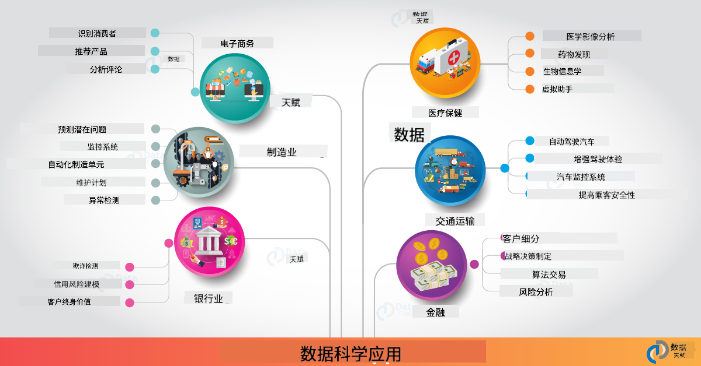

<!--
CO_OP_TRANSLATOR_METADATA:
{
  "original_hash": "0f67a4139454816631526779a456b734",
  "translation_date": "2025-09-06T18:16:26+00:00",
  "source_file": "6-Data-Science-In-Wild/20-Real-World-Examples/README.md",
  "language_code": "zh"
}
-->
# 数据科学在现实世界中的应用

|  ](../../sketchnotes/20-DataScience-RealWorld.png) |
| :--------------------------------------------------------------------------------------------------------------: |
|               数据科学在现实世界中的应用 - _Sketchnote by [@nitya](https://twitter.com/nitya)_               |

我们即将完成这段学习旅程！

我们从数据科学和伦理的定义开始，探索了各种数据分析和可视化工具与技术，回顾了数据科学生命周期，并研究了如何通过云计算服务扩展和自动化数据科学工作流程。那么，你可能会问：_"如何将这些学习内容映射到现实世界的场景中？"_

在本课中，我们将探讨数据科学在各行业中的实际应用，并深入研究在科研、数字人文和可持续发展领域的具体案例。我们还将讨论学生项目的机会，并提供一些有用的资源，帮助你继续学习之旅！

## 课前测验

## [课前测验](https://ff-quizzes.netlify.app/en/ds/quiz/38)

## 数据科学 + 行业

随着人工智能的普及，开发者现在可以更轻松地设计和集成基于人工智能的决策和数据驱动的洞察到用户体验和开发工作流程中。以下是数据科学在各行业中“应用”的一些实际案例：

 * [Google Flu Trends](https://www.wired.com/2015/10/can-learn-epic-failure-google-flu-trends/) 使用数据科学将搜索词与流感趋势相关联。尽管方法存在缺陷，但它提高了人们对数据驱动的医疗预测可能性（以及挑战）的认识。

 * [UPS 路线预测](https://www.technologyreview.com/2018/11/21/139000/how-ups-uses-ai-to-outsmart-bad-weather/) - 解释了 UPS 如何利用数据科学和机器学习预测最佳配送路线，考虑天气状况、交通模式、配送截止时间等因素。

 * [纽约出租车路线可视化](http://chriswhong.github.io/nyctaxi/) - 使用[信息自由法](https://chriswhong.com/open-data/foil_nyc_taxi/)收集的数据帮助可视化纽约出租车一天的运行情况，帮助我们了解它们如何在繁忙的城市中导航、赚取的收入以及每24小时内的行程时长。

 * [Uber 数据科学工作台](https://eng.uber.com/dsw/) - 每天从数百万次 Uber 行程中收集数据（如上下车地点、行程时长、偏好路线等），构建数据分析工具，用于定价、安全、欺诈检测和导航决策。

 * [体育分析](https://towardsdatascience.com/scope-of-analytics-in-sports-world-37ed09c39860) - 关注_预测分析_（团队和球员分析 - 想想[点球成金](https://datasciencedegree.wisconsin.edu/blog/moneyball-proves-importance-big-data-big-ideas/) - 以及粉丝管理）和_数据可视化_（团队和粉丝仪表盘、比赛等），应用包括人才选拔、体育博彩和库存/场馆管理。

 * [银行业中的数据科学](https://data-flair.training/blogs/data-science-in-banking/) - 强调数据科学在金融行业的价值，应用包括风险建模和欺诈检测、客户细分、实时预测和推荐系统。预测分析还推动了关键指标，如[信用评分](https://dzone.com/articles/using-big-data-and-predictive-analytics-for-credit)。

 * [医疗领域的数据科学](https://data-flair.training/blogs/data-science-in-healthcare/) - 强调应用包括医学影像（如 MRI、X光、CT扫描）、基因组学（DNA测序）、药物开发（风险评估、成功预测）、预测分析（患者护理和供应物流）、疾病追踪与预防等。

 图片来源：[Data Flair: 6 Amazing Data Science Applications ](https://data-flair.training/blogs/data-science-applications/)

图中展示了其他领域和数据科学技术的应用案例。想探索更多应用？查看下面的[复习与自学](../../../../6-Data-Science-In-Wild/20-Real-World-Examples)部分。

## 数据科学 + 科研

|  ](../../sketchnotes/20-DataScience-Research.png) |
| :---------------------------------------------------------------------------------------------------------------: |
|              数据科学与科研 - _Sketchnote by [@nitya](https://twitter.com/nitya)_              |

虽然现实世界的应用通常关注行业规模的用例，_科研_应用和项目可以从两个角度提供价值：

* _创新机会_ - 探索先进概念的快速原型设计以及下一代应用的用户体验测试。
* _部署挑战_ - 调查数据科学技术在现实世界中的潜在危害或意外后果。

对于学生来说，这些科研项目不仅提供学习和协作的机会，还能加深对主题的理解，并拓宽与相关领域的人员或团队的接触和参与。科研项目是什么样的？它们如何产生影响？

让我们看一个例子 - [MIT Gender Shades Study](http://gendershades.org/overview.html)，由 Joy Buolamwini（MIT Media Labs）发起，与 Timnit Gebru（当时在微软研究院）共同撰写了一篇[标志性研究论文](http://proceedings.mlr.press/v81/buolamwini18a/buolamwini18a.pdf)，重点研究：

 * **什么：** 研究项目的目标是_评估基于性别和肤色的自动化面部分析算法和数据集中的偏差_。
 * **为什么：** 面部分析被用于执法、机场安检、招聘系统等领域——这些场景中由于偏差导致的不准确分类可能对受影响的个人或群体造成经济和社会损害。理解（并消除或减轻）偏差是使用公平的关键。
 * **如何：** 研究人员发现现有基准主要使用肤色较浅的主体，并策划了一个新的数据集（1000+张图片），在性别和肤色上更加平衡。该数据集用于评估三个性别分类产品（来自微软、IBM和Face++）的准确性。

结果显示，尽管总体分类准确性较高，但不同子群体之间的错误率存在显著差异——**性别错误分类**在女性或肤色较深的人群中更高，表明存在偏差。

**关键成果：** 提高了对数据科学需要更多_代表性数据集_（平衡子群体）和更多_包容性团队_（多样化背景）的认识，以便在人工智能解决方案中更早地识别并消除或减轻这些偏差。像这样的研究努力对于许多组织定义_负责任的人工智能_原则和实践以提高其人工智能产品和流程的公平性也至关重要。

**想了解微软相关的研究工作？**

* 查看[微软研究项目](https://www.microsoft.com/research/research-area/artificial-intelligence/?facet%5Btax%5D%5Bmsr-research-area%5D%5B%5D=13556&facet%5Btax%5D%5Bmsr-content-type%5D%5B%5D=msr-project)中的人工智能领域。
* 探索[微软研究数据科学暑期学校](https://www.microsoft.com/en-us/research/academic-program/data-science-summer-school/)的学生项目。
* 查看[Fairlearn](https://fairlearn.org/)项目和[负责任的人工智能](https://www.microsoft.com/en-us/ai/responsible-ai?activetab=pivot1%3aprimaryr6)倡议。

## 数据科学 + 人文学科

|  ](../../sketchnotes/20-DataScience-Humanities.png) |
| :---------------------------------------------------------------------------------------------------------------: |
|              数据科学与数字人文学科 - _Sketchnote by [@nitya](https://twitter.com/nitya)_              |

数字人文学科[被定义为](https://digitalhumanities.stanford.edu/about-dh-stanford)“结合计算方法与人文研究的一系列实践和方法”。[斯坦福项目](https://digitalhumanities.stanford.edu/projects)如_“重启历史”_和_“诗意思维”_展示了[数字人文学科与数据科学](https://digitalhumanities.stanford.edu/digital-humanities-and-data-science)之间的联系——强调网络分析、信息可视化、空间和文本分析等技术，这些技术可以帮助我们重新审视历史和文学数据集，从而获得新的洞察和视角。

*想探索并扩展这一领域的项目？*

查看["Emily Dickinson and the Meter of Mood"](https://gist.github.com/jlooper/ce4d102efd057137bc000db796bfd671)——这是一个来自[Jen Looper](https://twitter.com/jenlooper)的优秀案例，探讨如何利用数据科学重新审视熟悉的诗歌，并在新的背景下重新评估其意义及作者的贡献。例如，_我们能否通过分析诗歌的语气或情感来预测其创作的季节_——这又能告诉我们作者在相关时期的心境如何？

为回答这个问题，我们遵循数据科学生命周期的步骤：
 * [`数据获取`](https://gist.github.com/jlooper/ce4d102efd057137bc000db796bfd671#acquiring-the-dataset) - 收集相关数据集进行分析。选项包括使用 API（如[Poetry DB API](https://poetrydb.org/index.html)）或使用工具（如[Scrapy](https://scrapy.org/)）抓取网页（如[Project Gutenberg](https://www.gutenberg.org/files/12242/12242-h/12242-h.htm)）。
 * [`数据清理`](https://gist.github.com/jlooper/ce4d102efd057137bc000db796bfd671#clean-the-data) - 解释如何使用基本工具（如 Visual Studio Code 和 Microsoft Excel）格式化、清理和简化文本。
 * [`数据分析`](https://gist.github.com/jlooper/ce4d102efd057137bc000db796bfd671#working-with-the-data-in-a-notebook) - 解释如何将数据集导入“笔记本”进行分析，使用 Python 包（如 pandas、numpy 和 matplotlib）组织和可视化数据。
 * [`情感分析`](https://gist.github.com/jlooper/ce4d102efd057137bc000db796bfd671#sentiment-analysis-using-cognitive-services) - 解释如何集成云服务（如文本分析），使用低代码工具（如[Power Automate](https://flow.microsoft.com/en-us/)）实现自动化数据处理工作流程。

通过这一工作流程，我们可以探索季节对诗歌情感的影响，并帮助我们形成对作者的独特视角。自己试试吧——然后扩展笔记本，提出其他问题或以新的方式可视化数据！

> 你可以使用[数字人文学科工具包](https://github.com/Digital-Humanities-Toolkit)中的一些工具来探索这些研究方向。

## 数据科学 + 可持续发展

|  ](../../sketchnotes/20-DataScience-Sustainability.png) |
| :---------------------------------------------------------------------------------------------------------------: |
|              数据科学与可持续发展 - _Sketchnote by [@nitya](https://twitter.com/nitya)_              |

[2030年可持续发展议程](https://sdgs.un.org/2030agenda)——由所有联合国成员国于2015年通过——确定了17个目标，其中包括**保护地球**免受退化和气候变化影响。[微软可持续发展](https://www.microsoft.com/en-us/sustainability)倡议支持这些目标，探索技术解决方案如何支持并构建更可持续的未来，重点关注[四个目标](https://dev.to/azure/a-visual-guide-to-sustainable-software-engineering-53hh)——到2030年实现碳负、水正、零废物和生物多样性。

以可扩展和及时的方式解决这些挑战需要云规模的思维——以及大规模数据。[Planetary Computer](https://planetarycomputer.microsoft.com/)倡议为数据科学家和开发者提供了四个组件来支持这一努力：

 * [数据目录](https://planetarycomputer.microsoft.com/catalog) - 提供数PB的地球系统数据（免费且托管于 Azure）。
 * [Planetary API](https://planetarycomputer.microsoft.com/docs/reference/stac/) - 帮助用户在空间和时间范围内搜索相关数据。
 * [Hub](https://planetarycomputer.microsoft.com/docs/overview/environment/) - 为科学家提供处理海量地理空间数据集的托管环境。
 * [应用](https://planetarycomputer.microsoft.com/applications) - 展示可持续发展洞察的用例和工具。
**Planetary Computer 项目目前处于预览阶段（截至 2021 年 9 月）** - 以下是如何通过数据科学开始为可持续发展解决方案做出贡献的指南。

* [申请访问权限](https://planetarycomputer.microsoft.com/account/request)，开始探索并与同行建立联系。
* [查看文档](https://planetarycomputer.microsoft.com/docs/overview/about)，了解支持的数据集和 API。
* 探索像 [生态系统监测](https://analytics-lab.org/ecosystemmonitoring/) 这样的应用，寻找应用创意的灵感。

思考如何利用数据可视化揭示或放大与气候变化和森林砍伐等领域相关的洞察。或者思考如何利用这些洞察来创造新的用户体验，激励行为改变以实现更可持续的生活。

## 数据科学 + 学生

我们已经讨论了行业和研究中的实际应用，并探索了数字人文和可持续发展领域的数据科学应用示例。那么，作为数据科学初学者，你如何提升技能并分享你的专业知识呢？

以下是一些数据科学学生项目的示例，供你参考。

 * [MSR 数据科学夏季学校](https://www.microsoft.com/en-us/research/academic-program/data-science-summer-school/#!projects)，以及 GitHub 上的 [项目](https://github.com/msr-ds3)，探索以下主题：
    - [警察使用武力中的种族偏见](https://www.microsoft.com/en-us/research/video/data-science-summer-school-2019-replicating-an-empirical-analysis-of-racial-differences-in-police-use-of-force/) | [Github](https://github.com/msr-ds3/stop-question-frisk)
    - [纽约地铁系统的可靠性](https://www.microsoft.com/en-us/research/video/data-science-summer-school-2018-exploring-the-reliability-of-the-nyc-subway-system/) | [Github](https://github.com/msr-ds3/nyctransit)
 * [数字化物质文化：探索 Sirkap 的社会经济分布](https://claremont.maps.arcgis.com/apps/Cascade/index.html?appid=bdf2aef0f45a4674ba41cd373fa23afc) - 来自 [Ornella Altunyan](https://twitter.com/ornelladotcom) 和 Claremont 团队，使用 [ArcGIS StoryMaps](https://storymaps.arcgis.com/)。

## 🚀 挑战

寻找推荐适合初学者的数据科学项目的文章，例如 [这 50 个主题领域](https://www.upgrad.com/blog/data-science-project-ideas-topics-beginners/)、[这 21 个项目创意](https://www.intellspot.com/data-science-project-ideas) 或 [这 16 个带源码的项目](https://data-flair.training/blogs/data-science-project-ideas/)，你可以拆解并重新组合这些项目。别忘了记录你的学习历程，并与我们分享你的洞察。

## 课后测验

## [课后测验](https://ff-quizzes.netlify.app/en/ds/quiz/39)

## 复习与自学

想要探索更多用例？以下是一些相关的文章：
 * [17 个数据科学应用及示例](https://builtin.com/data-science/data-science-applications-examples) - 2021 年 7 月
 * [11 个令人惊叹的现实世界数据科学应用](https://myblindbird.com/data-science-applications-real-world/) - 2021 年 5 月
 * [现实世界中的数据科学](https://towardsdatascience.com/data-science-in-the-real-world/home) - 文章合集
 * [12 个现实世界数据科学应用及示例](https://www.scaler.com/blog/data-science-applications/) - 2024 年 5 月
 * 数据科学在以下领域的应用：[教育](https://data-flair.training/blogs/data-science-in-education/)、[农业](https://data-flair.training/blogs/data-science-in-agriculture/)、[金融](https://data-flair.training/blogs/data-science-in-finance/)、[电影](https://data-flair.training/blogs/data-science-at-movies/)、[医疗保健](https://onlinedegrees.sandiego.edu/data-science-health-care/) 等。

## 作业

[探索一个 Planetary Computer 数据集](assignment.md)

---

**免责声明**：  
本文档使用AI翻译服务[Co-op Translator](https://github.com/Azure/co-op-translator)进行翻译。尽管我们努力确保准确性，但请注意，自动翻译可能包含错误或不准确之处。应以原始语言的文档作为权威来源。对于关键信息，建议使用专业人工翻译。因使用本翻译而导致的任何误解或误读，我们概不负责。