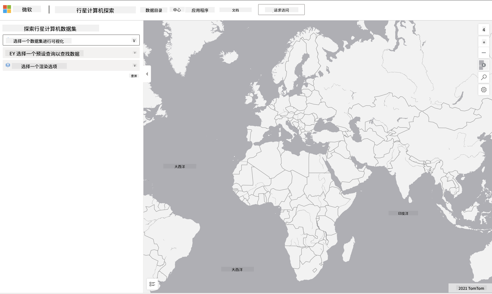

<!--
CO_OP_TRANSLATOR_METADATA:
{
  "original_hash": "d1e05715f9d97de6c4f1fb0c5a4702c0",
  "translation_date": "2025-08-25T17:18:01+00:00",
  "source_file": "6-Data-Science-In-Wild/20-Real-World-Examples/assignment.md",
  "language_code": "zh"
}
-->
# 探索行星计算机数据集

## 说明

在本课中，我们讨论了各种数据科学应用领域，并深入研究了与科研、可持续发展和数字人文相关的示例。在这个任务中，你将更详细地探索其中一个示例，并应用你在数据可视化和分析方面的学习，来从可持续发展数据中获取洞察。

[行星计算机](https://planetarycomputer.microsoft.com/)项目提供了可以通过账户访问的数据集和API——如果你想尝试任务的额外步骤，可以申请一个账户以获得访问权限。该网站还提供了一个[Explorer](https://planetarycomputer.microsoft.com/explore)功能，你可以在无需创建账户的情况下使用它。

`步骤：`
Explorer界面（如下图所示）允许你选择一个数据集（从提供的选项中），一个预设查询（用于过滤数据）以及一个渲染选项（用于创建相关的可视化）。在这个任务中，你需要：

 1. 阅读[Explorer文档](https://planetarycomputer.microsoft.com/docs/overview/explorer/)——了解选项。
 2. 探索数据集[目录](https://planetarycomputer.microsoft.com/catalog)——了解每个数据集的用途。
 3. 使用Explorer——选择一个感兴趣的数据集，选择一个相关的查询和渲染选项。

`你的任务：`
现在研究浏览器中渲染的可视化，并回答以下问题：
 * 数据集有哪些_特征_？
 * 可视化提供了哪些_洞察_或结果？
 * 这些洞察对项目的可持续发展目标有什么_意义_？
 * 可视化的_局限性_是什么（即，你没有获得哪些洞察？）
 * 如果你能获得原始数据，你会创建哪些_替代可视化_，为什么？

`额外加分：`
申请一个账户——并在获得批准后登录。
 * 使用 _Launch Hub_ 选项在Notebook中打开原始数据。
 * 交互式地探索数据，并实现你想到的替代可视化。
 * 现在分析你的自定义可视化——你是否能够获得之前遗漏的洞察？

## 评分标准

优秀 | 合格 | 需要改进
--- | --- | -- |
回答了所有五个核心问题。学生清楚地指出当前和替代可视化如何提供关于可持续发展目标或结果的洞察。| 学生详细回答了至少前三个问题，表明他们对Explorer有实际经验。| 学生未能回答多个问题，或提供的细节不足——表明未对项目进行有意义的尝试。 |

**免责声明**：  
本文档使用AI翻译服务 [Co-op Translator](https://github.com/Azure/co-op-translator) 进行翻译。尽管我们努力确保翻译的准确性，但请注意，自动翻译可能包含错误或不准确之处。原始语言的文档应被视为权威来源。对于关键信息，建议使用专业人工翻译。我们不对因使用此翻译而产生的任何误解或误读承担责任。