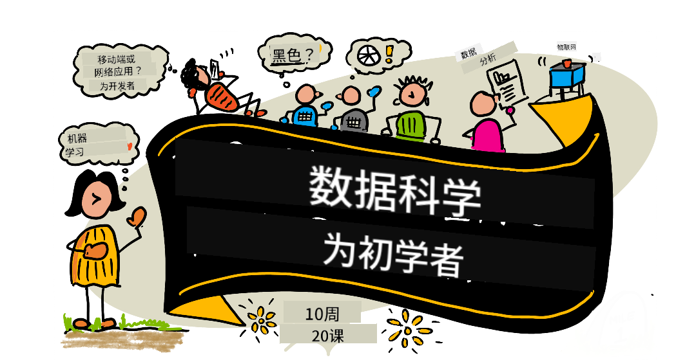

<!--
CO_OP_TRANSLATOR_METADATA:
{
  "original_hash": "f9a704f7494ca2d185ded59ba3da99ef",
  "translation_date": "2025-10-24T08:54:58+00:00",
  "source_file": "README.md",
  "language_code": "zh"
}
-->
# 数据科学入门 - 课程大纲

Azure云倡导者团队很高兴为大家提供一个为期10周、共20课的课程，内容涵盖数据科学的方方面面。每节课都包括课前和课后测验、完成课程的书面指导、解决方案以及作业。我们的项目式教学法让您在实践中学习，这是一种让新技能“扎根”的有效方式。

**衷心感谢我们的作者：** [Jasmine Greenaway](https://www.twitter.com/paladique)、[Dmitry Soshnikov](http://soshnikov.com)、[Nitya Narasimhan](https://twitter.com/nitya)、[Jalen McGee](https://twitter.com/JalenMcG)、[Jen Looper](https://twitter.com/jenlooper)、[Maud Levy](https://twitter.com/maudstweets)、[Tiffany Souterre](https://twitter.com/TiffanySouterre)、[Christopher Harrison](https://www.twitter.com/geektrainer)。

**🙏 特别感谢 🙏 我们的 [Microsoft Student Ambassador](https://studentambassadors.microsoft.com/) 作者、审阅者和内容贡献者，** 尤其是 Aaryan Arora、[Aditya Garg](https://github.com/AdityaGarg00)、[Alondra Sanchez](https://www.linkedin.com/in/alondra-sanchez-molina/)、[Ankita Singh](https://www.linkedin.com/in/ankitasingh007)、[Anupam Mishra](https://www.linkedin.com/in/anupam--mishra/)、[Arpita Das](https://www.linkedin.com/in/arpitadas01/)、ChhailBihari Dubey、[Dibri Nsofor](https://www.linkedin.com/in/dibrinsofor)、[Dishita Bhasin](https://www.linkedin.com/in/dishita-bhasin-7065281bb)、[Majd Safi](https://www.linkedin.com/in/majd-s/)、[Max Blum](https://www.linkedin.com/in/max-blum-6036a1186/)、[Miguel Correa](https://www.linkedin.com/in/miguelmque/)、[Mohamma Iftekher (Iftu) Ebne Jalal](https://twitter.com/iftu119)、[Nawrin Tabassum](https://www.linkedin.com/in/nawrin-tabassum)、[Raymond Wangsa Putra](https://www.linkedin.com/in/raymond-wp/)、[Rohit Yadav](https://www.linkedin.com/in/rty2423)、Samridhi Sharma、[Sanya Sinha](https://www.linkedin.com/mwlite/in/sanya-sinha-13aab1200)、[Sheena Narula](https://www.linkedin.com/in/sheena-narua-n/)、[Tauqeer Ahmad](https://www.linkedin.com/in/tauqeerahmad5201/)、Yogendrasingh Pawar、[Vidushi Gupta](https://www.linkedin.com/in/vidushi-gupta07/)、[Jasleen Sondhi](https://www.linkedin.com/in/jasleen-sondhi/)。

||
|:---:|
| 数据科学入门 - _速写图由 [@nitya](https://twitter.com/nitya) 绘制_ |

### 🌐 多语言支持

#### 通过 GitHub Action 支持（自动更新，始终保持最新）

[阿拉伯语](../ar/README.md) | [孟加拉语](../bn/README.md) | [保加利亚语](../bg/README.md) | [缅甸语](../my/README.md) | [中文（简体）](./README.md) | [中文（繁体，香港）](../hk/README.md) | [中文（繁体，澳门）](../mo/README.md) | [中文（繁体，台湾）](../tw/README.md) | [克罗地亚语](../hr/README.md) | [捷克语](../cs/README.md) | [丹麦语](../da/README.md) | [荷兰语](../nl/README.md) | [爱沙尼亚语](../et/README.md) | [芬兰语](../fi/README.md) | [法语](../fr/README.md) | [德语](../de/README.md) | [希腊语](../el/README.md) | [希伯来语](../he/README.md) | [印地语](../hi/README.md) | [匈牙利语](../hu/README.md) | [印尼语](../id/README.md) | [意大利语](../it/README.md) | [日语](../ja/README.md) | [韩语](../ko/README.md) | [立陶宛语](../lt/README.md) | [马来语](../ms/README.md) | [马拉地语](../mr/README.md) | [尼泊尔语](../ne/README.md) | [挪威语](../no/README.md) | [波斯语](../fa/README.md) | [波兰语](../pl/README.md) | [葡萄牙语（巴西）](../br/README.md) | [葡萄牙语（葡萄牙）](../pt/README.md) | [旁遮普语](../pa/README.md) | [罗马尼亚语](../ro/README.md) | [俄语](../ru/README.md) | [塞尔维亚语（西里尔字母）](../sr/README.md) | [斯洛伐克语](../sk/README.md) | [斯洛文尼亚语](../sl/README.md) | [西班牙语](../es/README.md) | [斯瓦希里语](../sw/README.md) | [瑞典语](../sv/README.md) | [塔加洛语](../tl/README.md) | [泰米尔语](../ta/README.md) | [泰语](../th/README.md) | [土耳其语](../tr/README.md) | [乌克兰语](../uk/README.md) | [乌尔都语](../ur/README.md) | [越南语](../vi/README.md)

**如果您希望支持其他语言，支持的语言列表请参见 [这里](https://github.com/Azure/co-op-translator/blob/main/getting_started/supported-languages.md)**

#### 加入我们的社区

我们正在进行一个关于AI学习的Discord系列活动，了解更多并加入我们：[AI学习系列](https://aka.ms/learnwithai/discord)，活动时间为2025年9月18日至30日。您将学习使用GitHub Copilot进行数据科学的技巧和窍门。

# 您是学生吗？

从以下资源开始：

- [学生中心页面](https://docs.microsoft.com/en-gb/learn/student-hub?WT.mc_id=academic-77958-bethanycheum) 在此页面，您可以找到入门资源、学生礼包，甚至获取免费认证券的方法。建议您将此页面加入书签并定期查看，因为我们至少每月更新一次内容。
- [Microsoft Learn Student Ambassadors](https://studentambassadors.microsoft.com?WT.mc_id=academic-77958-bethanycheum) 加入全球学生大使社区，这可能是您进入微软的途径。

# 入门指南

## 📚 文档

- **[安装指南](INSTALLATION.md)** - 初学者的逐步设置说明
- **[使用指南](USAGE.md)** - 示例和常见工作流程
- **[故障排除](TROUBLESHOOTING.md)** - 常见问题的解决方案
- **[贡献指南](CONTRIBUTING.md)** - 如何为此项目做出贡献
- **[教师资源](for-teachers.md)** - 教学指导和课堂资源

## 👨‍🎓 面向学生
> **完全初学者**：刚接触数据科学？从我们的[初学者友好示例](examples/README.md)开始！这些简单且注释详尽的示例将帮助您在深入学习完整课程之前理解基础知识。
> **[学生](https://aka.ms/student-page)**：如果您想独立使用此课程，请fork整个仓库并独立完成练习，从课前测验开始。然后阅读课程内容并完成其他活动。尝试通过理解课程内容来创建项目，而不是直接复制解决方案代码；不过，解决方案代码可以在每个项目课程的/solutions文件夹中找到。另一个建议是与朋友组成学习小组，一起学习内容。进一步学习，我们推荐 [Microsoft Learn](https://docs.microsoft.com/en-us/users/jenlooper-2911/collections/qprpajyoy3x0g7?WT.mc_id=academic-77958-bethanycheum)。

**快速开始：**
1. 查看[安装指南](INSTALLATION.md)以设置您的环境
2. 阅读[使用指南](USAGE.md)以了解如何使用课程内容
3. 从第一课开始，按顺序学习
4. 加入我们的[Discord社区](https://aka.ms/ds4beginners/discord)以获得支持

## 👩‍🏫 面向教师

> **教师**：我们[提供了一些建议](for-teachers.md)，说明如何使用此课程。我们非常欢迎您在[讨论论坛](https://github.com/microsoft/Data-Science-For-Beginners/discussions)中提供反馈！

## 团队介绍

**Gif制作人** [Mohit Jaisal](https://www.linkedin.com/in/mohitjaisal)

> 🎥 点击上方图片观看关于项目及其创作者的视频！

## 教学法
我们在设计这套课程时选择了两个教学原则：确保课程以项目为基础，并包含频繁的测验。通过这一系列课程，学生将学习数据科学的基本原理，包括伦理概念、数据准备、不同的数据处理方式、数据可视化、数据分析、数据科学的实际应用案例等。

此外，课前的低压力测验可以帮助学生明确学习目标，而课后的第二次测验则有助于进一步巩固知识。这套课程设计灵活有趣，可以完整学习，也可以选择部分内容学习。项目从简单开始，随着10周课程的推进逐渐变得复杂。

> 查看我们的[行为准则](CODE_OF_CONDUCT.md)、[贡献指南](CONTRIBUTING.md)、[翻译指南](TRANSLATIONS.md)。我们欢迎您的建设性反馈！

## 每节课包括：

- 可选的手绘笔记
- 可选的补充视频
- 课前热身测验
- 书面课程
- 对于基于项目的课程，提供逐步指导如何完成项目
- 知识检查
- 挑战任务
- 补充阅读材料
- 作业
- [课后测验](https://ff-quizzes.netlify.app/en/)

> **关于测验的说明**：所有测验都包含在Quiz-App文件夹中，共有40个测验，每个测验包含三个问题。测验链接嵌入在课程中，但测验应用可以在本地运行或部署到Azure；请按照`quiz-app`文件夹中的说明操作。测验正在逐步进行本地化。

## 🎓 初学者友好的示例

**数据科学新手？** 我们创建了一个特别的[示例目录](examples/README.md)，其中包含简单且注释详细的代码，帮助您入门：

- 🌟 **Hello World** - 您的第一个数据科学程序
- 📂 **加载数据** - 学习如何读取和探索数据集
- 📊 **简单分析** - 计算统计数据并发现模式
- 📈 **基础可视化** - 创建图表和图形
- 🔬 **实际项目** - 从头到尾的完整工作流程

每个示例都包含详细的注释，解释每一步，非常适合绝对初学者！

👉 **[从示例开始](examples/README.md)** 👈

## 课程

||
|:---:|
| 数据科学初学者：路线图 - _手绘笔记由 [@nitya](https://twitter.com/nitya)_ |

| 课程编号 | 主题 | 课程分组 | 学习目标 | 课程链接 | 作者 |
| :-----------: | :----------------------------------------: | :--------------------------------------------------: | :-----------------------------------------------------------------------------------------------------------------------------------------------------------------------: | :---------------------------------------------------------------------: | :----: |
| 01 | 定义数据科学 | [介绍](1-Introduction/README.md) | 学习数据科学的基本概念及其与人工智能、机器学习和大数据的关系。 | [课程](1-Introduction/01-defining-data-science/README.md) [视频](https://youtu.be/beZ7Mb_oz9I) | [Dmitry](http://soshnikov.com) |
| 02 | 数据科学伦理 | [介绍](1-Introduction/README.md) | 数据伦理概念、挑战与框架。 | [课程](1-Introduction/02-ethics/README.md) | [Nitya](https://twitter.com/nitya) |
| 03 | 定义数据 | [介绍](1-Introduction/README.md) | 数据的分类及其常见来源。 | [课程](1-Introduction/03-defining-data/README.md) | [Jasmine](https://www.twitter.com/paladique) |
| 04 | 统计与概率简介 | [介绍](1-Introduction/README.md) | 使用概率和统计的数学技术来理解数据。 | [课程](1-Introduction/04-stats-and-probability/README.md) [视频](https://youtu.be/Z5Zy85g4Yjw) | [Dmitry](http://soshnikov.com) |
| 05 | 使用关系型数据 | [数据处理](2-Working-With-Data/README.md) | 介绍关系型数据以及使用结构化查询语言（SQL）探索和分析关系型数据的基础知识。 | [课程](2-Working-With-Data/05-relational-databases/README.md) | [Christopher](https://www.twitter.com/geektrainer) | | |
| 06 | 使用NoSQL数据 | [数据处理](2-Working-With-Data/README.md) | 介绍非关系型数据及其各种类型，以及探索和分析文档数据库的基础知识。 | [课程](2-Working-With-Data/06-non-relational/README.md) | [Jasmine](https://twitter.com/paladique)|
| 07 | 使用Python | [数据处理](2-Working-With-Data/README.md) | 使用Python进行数据探索的基础知识，涉及如Pandas等库。建议具备Python编程的基础知识。 | [课程](2-Working-With-Data/07-python/README.md) [视频](https://youtu.be/dZjWOGbsN4Y) | [Dmitry](http://soshnikov.com) |
| 08 | 数据准备 | [数据处理](2-Working-With-Data/README.md) | 数据清理和转换技术，处理缺失、不准确或不完整数据的挑战。 | [课程](2-Working-With-Data/08-data-preparation/README.md) | [Jasmine](https://www.twitter.com/paladique) |
| 09 | 数据量的可视化 | [数据可视化](3-Data-Visualization/README.md) | 学习如何使用Matplotlib可视化鸟类数据 🦆 | [课程](3-Data-Visualization/09-visualization-quantities/README.md) | [Jen](https://twitter.com/jenlooper) |
| 10 | 数据分布的可视化 | [数据可视化](3-Data-Visualization/README.md) | 可视化区间内的观察和趋势。 | [课程](3-Data-Visualization/10-visualization-distributions/README.md) | [Jen](https://twitter.com/jenlooper) |
| 11 | 比例的可视化 | [数据可视化](3-Data-Visualization/README.md) | 可视化离散和分组百分比。 | [课程](3-Data-Visualization/11-visualization-proportions/README.md) | [Jen](https://twitter.com/jenlooper) |
| 12 | 关系的可视化 | [数据可视化](3-Data-Visualization/README.md) | 可视化数据集及其变量之间的连接和相关性。 | [课程](3-Data-Visualization/12-visualization-relationships/README.md) | [Jen](https://twitter.com/jenlooper) |
| 13 | 有意义的可视化 | [数据可视化](3-Data-Visualization/README.md) | 提供技术和指导，使您的可视化在解决问题和洞察方面更有价值。 | [课程](3-Data-Visualization/13-meaningful-visualizations/README.md) | [Jen](https://twitter.com/jenlooper) |
| 14 | 数据科学生命周期简介 | [生命周期](4-Data-Science-Lifecycle/README.md) | 数据科学生命周期的介绍及其第一步：数据获取和提取。 | [课程](4-Data-Science-Lifecycle/14-Introduction/README.md) | [Jasmine](https://twitter.com/paladique) |
| 15 | 数据分析 | [生命周期](4-Data-Science-Lifecycle/README.md) | 数据科学生命周期的这一阶段专注于数据分析技术。 | [课程](4-Data-Science-Lifecycle/15-analyzing/README.md) | [Jasmine](https://twitter.com/paladique) | | |
| 16 | 数据沟通 | [生命周期](4-Data-Science-Lifecycle/README.md) | 数据科学生命周期的这一阶段专注于以易于决策者理解的方式呈现数据洞察。 | [课程](4-Data-Science-Lifecycle/16-communication/README.md) | [Jalen](https://twitter.com/JalenMcG) | | |
| 17 | 云端数据科学 | [云端数据](5-Data-Science-In-Cloud/README.md) | 这一系列课程介绍了云端数据科学及其优势。 | [课程](5-Data-Science-In-Cloud/17-Introduction/README.md) | [Tiffany](https://twitter.com/TiffanySouterre) 和 [Maud](https://twitter.com/maudstweets) |
| 18 | 云端数据科学 | [云端数据](5-Data-Science-In-Cloud/README.md) | 使用低代码工具训练模型。 |[课程](5-Data-Science-In-Cloud/18-Low-Code/README.md) | [Tiffany](https://twitter.com/TiffanySouterre) 和 [Maud](https://twitter.com/maudstweets) |
| 19 | 云端数据科学 | [云端数据](5-Data-Science-In-Cloud/README.md) | 使用Azure Machine Learning Studio部署模型。 | [课程](5-Data-Science-In-Cloud/19-Azure/README.md)| [Tiffany](https://twitter.com/TiffanySouterre) 和 [Maud](https://twitter.com/maudstweets) |
| 20 | 野外数据科学 | [野外数据](6-Data-Science-In-Wild/README.md) | 数据科学驱动的实际项目。 | [课程](6-Data-Science-In-Wild/20-Real-World-Examples/README.md) | [Nitya](https://twitter.com/nitya) |

## GitHub Codespaces

按照以下步骤在Codespace中打开此示例：
1. 点击“Code”下拉菜单，选择“Open with Codespaces”选项。
2. 在面板底部选择“+ New codespace”。
更多信息，请查看[GitHub文档](https://docs.github.com/en/codespaces/developing-in-codespaces/creating-a-codespace-for-a-repository#creating-a-codespace)。

## VSCode Remote - Containers
按照以下步骤使用本地机器和VSCode通过VS Code Remote - Containers扩展打开此仓库：

1. 如果这是您第一次使用开发容器，请确保您的系统满足前置条件（例如安装了Docker），请参考[入门文档](https://code.visualstudio.com/docs/devcontainers/containers#_getting-started)。

要使用此仓库，您可以选择在隔离的Docker卷中打开仓库：

**注意**：底层将使用Remote-Containers: **Clone Repository in Container Volume...**命令将源代码克隆到Docker卷中，而不是本地文件系统。[卷](https://docs.docker.com/storage/volumes/)是持久化容器数据的首选机制。

或者打开本地克隆或下载的仓库版本：

- 将此仓库克隆到您的本地文件系统。
- 按F1并选择**Remote-Containers: Open Folder in Container...**命令。
- 选择克隆的文件夹，等待容器启动并尝试操作。

## 离线访问

您可以使用[Docsify](https://docsify.js.org/#/)离线运行此文档。Fork此仓库，在您的本地机器上[安装Docsify](https://docsify.js.org/#/quickstart)，然后在此仓库的根文件夹中输入`docsify serve`。网站将通过本地端口3000提供服务：`localhost:3000`。

> 注意，笔记本文件无法通过Docsify渲染，因此当您需要运行笔记本时，请在VS Code中单独运行Python内核。

## 其他课程

我们的团队还制作了其他课程！查看以下内容：

### Azure / Edge / MCP / Agents

  

---

### 生成式 AI 系列  
  
[-9333EA?style=for-the-badge&labelColor=E5E7EB&color=9333EA)](https://github.com/microsoft/Generative-AI-for-beginners-dotnet?WT.mc_id=academic-105485-koreyst)  
[-C084FC?style=for-the-badge&labelColor=E5E7EB&color=C084FC)](https://github.com/microsoft/generative-ai-for-beginners-java?WT.mc_id=academic-105485-koreyst)  
[-E879F9?style=for-the-badge&labelColor=E5E7EB&color=E879F9)](https://github.com/microsoft/generative-ai-with-javascript?WT.mc_id=academic-105485-koreyst)

---

### 核心学习  
  
  
  
  
  
  

---

### Copilot 系列  
  
  
  
<!-- CO-OP TRANSLATOR OTHER COURSES END -->

## 获取帮助  

**遇到问题？** 请查看我们的 [故障排除指南](TROUBLESHOOTING.md)，了解常见问题的解决方法。

如果您在构建 AI 应用时遇到困难或有任何问题，请加入：  

如果您有产品反馈或在构建过程中遇到错误，请访问：  

---

**免责声明**：  
本文档使用AI翻译服务[Co-op Translator](https://github.com/Azure/co-op-translator)进行翻译。尽管我们努力确保翻译的准确性，但请注意，自动翻译可能包含错误或不准确之处。原始语言的文档应被视为权威来源。对于关键信息，建议使用专业人工翻译。我们不对因使用此翻译而产生的任何误解或误读承担责任。